  - [Loading our data](#loading-our-data)
  - [Plots for the 2008 Results](#plots-for-the-2008-results)
      - [Florida](#florida)
      - [Iowa](#iowa)
      - [Michigan](#michigan)
      - [Nebraska](#nebraska)
      - [Ohio](#ohio)
      - [Pennsylvania](#pennsylvania)
      - [Wisconsin](#wisconsin)
  - [Plots for the 2012 Results](#plots-for-the-2012-results)
      - [Florida](#florida-1)
      - [Iowa](#iowa-1)
      - [Michigan](#michigan-1)
      - [Ohio](#ohio-1)
      - [Pennsylvania](#pennsylvania-1)
      - [Wisconsin](#wisconsin-1)
  - [Critical Result: Do these 2012 Obama-Trump counties matter? (Yes,
    they swung the
    election)](#critical-result-do-these-2012-obama-trump-counties-matter-yes-they-swung-the-election)

# Loading our data

We need a few helper functions to denormalize useful data in the rows.

``` r
winner_by_state_and_year <- function(results) {
  return(results %>% group_by(state,year) %>% filter(votepercentage==max(votepercentage)) %>%  arrange(party));
}
```

We need to normalize the parties, since the Democratic party in
Minnessota calls themselves the Democratic-Farmer-Labor party.

``` r
make_party_into_factor <- function(results) {
  results$party[results$party == 'democratic-farmer-labor'] <- 'democrat';
  results$party[is.na(results$party)] <- '$third-party';
  results$party <- as.factor(results$party);
  return(results);
}
add_vote_percentage <- function(results) {
  results$votepercentage <- with(results, candidatevotes/totalvotes);
  return(results);
}
```

We need a helper function to load `RData` files into specified
variables.

``` r
load_obj <- function(path) {
  env <- new.env();
  nm <- load(path,env)[1];
  env[[nm]];
}
```

``` r
count_alternates <- function(column) {
  count <- 0;
  if (length(column) > 0) {
    val <- column[[1]][1];
    for (i in 2:length(column)) {
      if (column[[i]][1] != val) {
        val <- column[[i]][1];
        count <- count + 1;
      }
    }
  }
  return(count);
}
```

``` r
number_of_swings_since <- function(results, election_year, state_name, number_of_elections=7) {
  start_year <- election_year - (number_of_elections - 1)*4;
  has_data <- (1976 <= start_year);
  is_election_year <- ((election_year - 1976)%%4 == 0);
  if (!has_data || !is_election_year) {
    return(0);
  } else {
    parties<-results[which(results$state==state_name & start_year <= results$year & results$year <= election_year),c("party")];
    return(count_alternates(parties[["party"]]));
  }
}

has_swung_since <- function(results, election_year, state_name, number_of_elections=7) {
  return(number_of_swings_since(results, election_year, state_name, number_of_elections) > 1);
}
```

``` r
state_path <- "../data/elections/presidential/state/1976_2016_president.RData"
state_results <- load_obj(state_path);
state_results <- make_party_into_factor(state_results);
state_results <- add_vote_percentage(state_results);
state_winner_data <- winner_by_state_and_year(state_results);
state_winner_data <- state_winner_data[with(state_winner_data,order(state,year)), ]

swing_data <- state_winner_data[which(state_winner_data$year >= 2000),c("state","year")]
```

``` r
for (i in 1:nrow(swing_data)) {
  row <- swing_data[i,];
  year <- row[['year']];
  state <- row[['state']];
  swing_data[which(swing_data$state == state & swing_data$year == year),c('swings')] <- number_of_swings_since(state_winner_data,year,state,2);
}
```

The states we are interested in examining are the ones which have swung
from Obama to
Trump.

``` r
kable(swing_data[which(swing_data$year==2016 & swing_data$swings>=1),])
```

<table>

<thead>

<tr>

<th style="text-align:left;">

state

</th>

<th style="text-align:right;">

year

</th>

<th style="text-align:right;">

swings

</th>

</tr>

</thead>

<tbody>

<tr>

<td style="text-align:left;">

Florida

</td>

<td style="text-align:right;">

2016

</td>

<td style="text-align:right;">

1

</td>

</tr>

<tr>

<td style="text-align:left;">

Iowa

</td>

<td style="text-align:right;">

2016

</td>

<td style="text-align:right;">

1

</td>

</tr>

<tr>

<td style="text-align:left;">

Michigan

</td>

<td style="text-align:right;">

2016

</td>

<td style="text-align:right;">

1

</td>

</tr>

<tr>

<td style="text-align:left;">

Nebraska

</td>

<td style="text-align:right;">

2016

</td>

<td style="text-align:right;">

1

</td>

</tr>

<tr>

<td style="text-align:left;">

Ohio

</td>

<td style="text-align:right;">

2016

</td>

<td style="text-align:right;">

1

</td>

</tr>

<tr>

<td style="text-align:left;">

Pennsylvania

</td>

<td style="text-align:right;">

2016

</td>

<td style="text-align:right;">

1

</td>

</tr>

<tr>

<td style="text-align:left;">

Wisconsin

</td>

<td style="text-align:right;">

2016

</td>

<td style="text-align:right;">

1

</td>

</tr>

</tbody>

</table>

``` r
path <- "../data/elections/presidential/county/countypres_2000-2016.RData"
results <- load_obj(path);
results <- make_party_into_factor(results);
results <- add_vote_percentage(results);
winner_data <- winner_by_state_and_year(results);
winner_data <- winner_data[with(winner_data,order(state,county,year)), ]
```

We now want to drill down on the states which were won by Obama but
switched to
Trump.

``` r
states <- swing_data[which(swing_data$year==2016 & swing_data$swings>=1),c('state')]$state
relevant_data <- results[results$state %in% states,]
```

We want to find, among these states, which counties were won by Obama
but switched to Trump. We don’t know if comparing 2008 to 2016 is more
meaningful than 2012 to 2016, so we gather all the data we
can.

``` r
counties_obama_won_2008 <- relevant_data %>% filter(year==2008) %>% group_by(state,county) %>% filter(votepercentage==max(votepercentage)) %>%  arrange(party) %>% filter(party=='democrat')
counties_obama_won_2008 <- add_vote_percentage(counties_obama_won_2008)

counties_obama_won_2012 <- relevant_data %>% filter(year==2012) %>% group_by(state,county) %>% filter(votepercentage==max(votepercentage)) %>%  arrange(party) %>% filter(party=='democrat')
counties_obama_won_2012 <- add_vote_percentage(counties_obama_won_2012)

counties_trump_won <- relevant_data %>% filter(year==2016) %>% group_by(state,county) %>% filter(votepercentage==max(votepercentage)) %>%  arrange(party) %>% filter(party=='republican')
counties_trump_won <- add_vote_percentage(counties_trump_won)
```

Now we are curious about the counties which swung from Obama to Trump,
which we will try measuring in terms of percent of votes
cast.

``` r
trump_intersect_2008 <- counties_trump_won[counties_trump_won$state %in% counties_obama_won_2008$state & counties_trump_won$county %in% counties_obama_won_2008$county,]
obama_intersect_2008 <- counties_obama_won_2008[counties_obama_won_2008$state %in% counties_trump_won$state & counties_obama_won_2008$county %in% counties_trump_won$county,]

compare_2008 <- merge(obama_intersect_2008, trump_intersect_2008, by=c('state','county','FIPS'))
compare_2008$trump_gain <- compare_2008$votepercentage.y - compare_2008$votepercentage.x

data_2008 <- compare_2008[which(compare_2008$trump_gain > 0),c('state','county','FIPS','trump_gain')]
```

``` r
kable(data_2008[order(-data_2008$trump_gain),])
```

<table>

<thead>

<tr>

<th style="text-align:left;">

</th>

<th style="text-align:left;">

state

</th>

<th style="text-align:left;">

county

</th>

<th style="text-align:right;">

FIPS

</th>

<th style="text-align:right;">

trump\_gain

</th>

</tr>

</thead>

<tbody>

<tr>

<td style="text-align:left;">

99

</td>

<td style="text-align:left;">

Ohio

</td>

<td style="text-align:left;">

Monroe

</td>

<td style="text-align:right;">

39111

</td>

<td style="text-align:right;">

0.1857589

</td>

</tr>

<tr>

<td style="text-align:left;">

111

</td>

<td style="text-align:left;">

Pennsylvania

</td>

<td style="text-align:left;">

Elk

</td>

<td style="text-align:right;">

42047

</td>

<td style="text-align:right;">

0.1836339

</td>

</tr>

<tr>

<td style="text-align:left;">

109

</td>

<td style="text-align:left;">

Pennsylvania

</td>

<td style="text-align:left;">

Cambria

</td>

<td style="text-align:right;">

42021

</td>

<td style="text-align:right;">

0.1754822

</td>

</tr>

<tr>

<td style="text-align:left;">

95

</td>

<td style="text-align:left;">

Ohio

</td>

<td style="text-align:left;">

Belmont

</td>

<td style="text-align:right;">

39013

</td>

<td style="text-align:right;">

0.1752567

</td>

</tr>

<tr>

<td style="text-align:left;">

97

</td>

<td style="text-align:left;">

Ohio

</td>

<td style="text-align:left;">

Jefferson

</td>

<td style="text-align:right;">

39081

</td>

<td style="text-align:right;">

0.1650945

</td>

</tr>

<tr>

<td style="text-align:left;">

83

</td>

<td style="text-align:left;">

Michigan

</td>

<td style="text-align:left;">

Ogemaw

</td>

<td style="text-align:right;">

26129

</td>

<td style="text-align:right;">

0.1566138

</td>

</tr>

<tr>

<td style="text-align:left;">

7

</td>

<td style="text-align:left;">

Iowa

</td>

<td style="text-align:left;">

Adams

</td>

<td style="text-align:right;">

19003

</td>

<td style="text-align:right;">

0.1555935

</td>

</tr>

<tr>

<td style="text-align:left;">

66

</td>

<td style="text-align:left;">

Michigan

</td>

<td style="text-align:left;">

Gladwin

</td>

<td style="text-align:right;">

26051

</td>

<td style="text-align:right;">

0.1536825

</td>

</tr>

<tr>

<td style="text-align:left;">

106

</td>

<td style="text-align:left;">

Ohio

</td>

<td style="text-align:left;">

Tuscarawas

</td>

<td style="text-align:right;">

39157

</td>

<td style="text-align:right;">

0.1514057

</td>

</tr>

<tr>

<td style="text-align:left;">

110

</td>

<td style="text-align:left;">

Pennsylvania

</td>

<td style="text-align:left;">

Carbon

</td>

<td style="text-align:right;">

42025

</td>

<td style="text-align:right;">

0.1511742

</td>

</tr>

<tr>

<td style="text-align:left;">

44

</td>

<td style="text-align:left;">

Iowa

</td>

<td style="text-align:left;">

Palo Alto

</td>

<td style="text-align:right;">

19147

</td>

<td style="text-align:right;">

0.1499119

</td>

</tr>

<tr>

<td style="text-align:left;">

21

</td>

<td style="text-align:left;">

Iowa

</td>

<td style="text-align:left;">

Crawford

</td>

<td style="text-align:right;">

19047

</td>

<td style="text-align:right;">

0.1491354

</td>

</tr>

<tr>

<td style="text-align:left;">

38

</td>

<td style="text-align:left;">

Iowa

</td>

<td style="text-align:left;">

Kossuth

</td>

<td style="text-align:right;">

19109

</td>

<td style="text-align:right;">

0.1483816

</td>

</tr>

<tr>

<td style="text-align:left;">

25

</td>

<td style="text-align:left;">

Iowa

</td>

<td style="text-align:left;">

Emmet

</td>

<td style="text-align:right;">

19063

</td>

<td style="text-align:right;">

0.1448065

</td>

</tr>

<tr>

<td style="text-align:left;">

159

</td>

<td style="text-align:left;">

Wisconsin

</td>

<td style="text-align:left;">

Waushara

</td>

<td style="text-align:right;">

55137

</td>

<td style="text-align:right;">

0.1439049

</td>

</tr>

<tr>

<td style="text-align:left;">

143

</td>

<td style="text-align:left;">

Wisconsin

</td>

<td style="text-align:left;">

Oconto

</td>

<td style="text-align:right;">

55083

</td>

<td style="text-align:right;">

0.1400246

</td>

</tr>

<tr>

<td style="text-align:left;">

136

</td>

<td style="text-align:left;">

Wisconsin

</td>

<td style="text-align:left;">

Langlade

</td>

<td style="text-align:right;">

55067

</td>

<td style="text-align:right;">

0.1370417

</td>

</tr>

<tr>

<td style="text-align:left;">

28

</td>

<td style="text-align:left;">

Iowa

</td>

<td style="text-align:left;">

Franklin

</td>

<td style="text-align:right;">

19069

</td>

<td style="text-align:right;">

0.1364805

</td>

</tr>

<tr>

<td style="text-align:left;">

154

</td>

<td style="text-align:left;">

Wisconsin

</td>

<td style="text-align:left;">

Shawano

</td>

<td style="text-align:right;">

55115

</td>

<td style="text-align:right;">

0.1344544

</td>

</tr>

<tr>

<td style="text-align:left;">

56

</td>

<td style="text-align:left;">

Michigan

</td>

<td style="text-align:left;">

Arenac

</td>

<td style="text-align:right;">

26011

</td>

<td style="text-align:right;">

0.1319954

</td>

</tr>

<tr>

<td style="text-align:left;">

90

</td>

<td style="text-align:left;">

Michigan

</td>

<td style="text-align:left;">

St. Clair

</td>

<td style="text-align:right;">

26147

</td>

<td style="text-align:right;">

0.1260289

</td>

</tr>

<tr>

<td style="text-align:left;">

85

</td>

<td style="text-align:left;">

Michigan

</td>

<td style="text-align:left;">

Presque Isle

</td>

<td style="text-align:right;">

26141

</td>

<td style="text-align:right;">

0.1258428

</td>

</tr>

<tr>

<td style="text-align:left;">

70

</td>

<td style="text-align:left;">

Michigan

</td>

<td style="text-align:left;">

Iron

</td>

<td style="text-align:right;">

26071

</td>

<td style="text-align:right;">

0.1219897

</td>

</tr>

<tr>

<td style="text-align:left;">

140

</td>

<td style="text-align:left;">

Wisconsin

</td>

<td style="text-align:left;">

Marinette

</td>

<td style="text-align:right;">

55075

</td>

<td style="text-align:right;">

0.1215594

</td>

</tr>

<tr>

<td style="text-align:left;">

62

</td>

<td style="text-align:left;">

Michigan

</td>

<td style="text-align:left;">

Clare

</td>

<td style="text-align:right;">

26035

</td>

<td style="text-align:right;">

0.1206352

</td>

</tr>

<tr>

<td style="text-align:left;">

86

</td>

<td style="text-align:left;">

Michigan

</td>

<td style="text-align:left;">

Roscommon

</td>

<td style="text-align:right;">

26143

</td>

<td style="text-align:right;">

0.1202409

</td>

</tr>

<tr>

<td style="text-align:left;">

31

</td>

<td style="text-align:left;">

Iowa

</td>

<td style="text-align:left;">

Hardin

</td>

<td style="text-align:right;">

19083

</td>

<td style="text-align:right;">

0.1198473

</td>

</tr>

<tr>

<td style="text-align:left;">

119

</td>

<td style="text-align:left;">

Wisconsin

</td>

<td style="text-align:left;">

Burnett

</td>

<td style="text-align:right;">

55013

</td>

<td style="text-align:right;">

0.1198152

</td>

</tr>

<tr>

<td style="text-align:left;">

9

</td>

<td style="text-align:left;">

Iowa

</td>

<td style="text-align:left;">

Audubon

</td>

<td style="text-align:right;">

19009

</td>

<td style="text-align:right;">

0.1197667

</td>

</tr>

<tr>

<td style="text-align:left;">

14

</td>

<td style="text-align:left;">

Iowa

</td>

<td style="text-align:left;">

Carroll

</td>

<td style="text-align:right;">

19027

</td>

<td style="text-align:right;">

0.1191066

</td>

</tr>

<tr>

<td style="text-align:left;">

61

</td>

<td style="text-align:left;">

Michigan

</td>

<td style="text-align:left;">

Cass

</td>

<td style="text-align:right;">

26027

</td>

<td style="text-align:right;">

0.1178480

</td>

</tr>

<tr>

<td style="text-align:left;">

158

</td>

<td style="text-align:left;">

Wisconsin

</td>

<td style="text-align:left;">

Waupaca

</td>

<td style="text-align:right;">

55135

</td>

<td style="text-align:right;">

0.1143771

</td>

</tr>

<tr>

<td style="text-align:left;">

151

</td>

<td style="text-align:left;">

Wisconsin

</td>

<td style="text-align:left;">

Rusk

</td>

<td style="text-align:right;">

55107

</td>

<td style="text-align:right;">

0.1138805

</td>

</tr>

<tr>

<td style="text-align:left;">

122

</td>

<td style="text-align:left;">

Wisconsin

</td>

<td style="text-align:left;">

Clark

</td>

<td style="text-align:right;">

55019

</td>

<td style="text-align:right;">

0.1105117

</td>

</tr>

<tr>

<td style="text-align:left;">

88

</td>

<td style="text-align:left;">

Michigan

</td>

<td style="text-align:left;">

Schoolcraft

</td>

<td style="text-align:right;">

26153

</td>

<td style="text-align:right;">

0.1104562

</td>

</tr>

<tr>

<td style="text-align:left;">

18

</td>

<td style="text-align:left;">

Iowa

</td>

<td style="text-align:left;">

Clarke

</td>

<td style="text-align:right;">

19039

</td>

<td style="text-align:right;">

0.1099032

</td>

</tr>

<tr>

<td style="text-align:left;">

69

</td>

<td style="text-align:left;">

Michigan

</td>

<td style="text-align:left;">

Iosco

</td>

<td style="text-align:right;">

26069

</td>

<td style="text-align:right;">

0.1093890

</td>

</tr>

<tr>

<td style="text-align:left;">

55

</td>

<td style="text-align:left;">

Michigan

</td>

<td style="text-align:left;">

Alpena

</td>

<td style="text-align:right;">

26007

</td>

<td style="text-align:right;">

0.1076792

</td>

</tr>

<tr>

<td style="text-align:left;">

40

</td>

<td style="text-align:left;">

Iowa

</td>

<td style="text-align:left;">

Louisa

</td>

<td style="text-align:right;">

19115

</td>

<td style="text-align:right;">

0.1000146

</td>

</tr>

<tr>

<td style="text-align:left;">

84

</td>

<td style="text-align:left;">

Michigan

</td>

<td style="text-align:left;">

Ontonagon

</td>

<td style="text-align:right;">

26131

</td>

<td style="text-align:right;">

0.0969867

</td>

</tr>

<tr>

<td style="text-align:left;">

47

</td>

<td style="text-align:left;">

Iowa

</td>

<td style="text-align:left;">

Union

</td>

<td style="text-align:right;">

19175

</td>

<td style="text-align:right;">

0.0967237

</td>

</tr>

<tr>

<td style="text-align:left;">

22

</td>

<td style="text-align:left;">

Iowa

</td>

<td style="text-align:left;">

Delaware

</td>

<td style="text-align:right;">

19055

</td>

<td style="text-align:right;">

0.0938662

</td>

</tr>

<tr>

<td style="text-align:left;">

82

</td>

<td style="text-align:left;">

Michigan

</td>

<td style="text-align:left;">

Oceana

</td>

<td style="text-align:right;">

26127

</td>

<td style="text-align:right;">

0.0938362

</td>

</tr>

<tr>

<td style="text-align:left;">

33

</td>

<td style="text-align:left;">

Iowa

</td>

<td style="text-align:left;">

Iowa

</td>

<td style="text-align:right;">

19095

</td>

<td style="text-align:right;">

0.0928767

</td>

</tr>

<tr>

<td style="text-align:left;">

29

</td>

<td style="text-align:left;">

Iowa

</td>

<td style="text-align:left;">

Greene

</td>

<td style="text-align:right;">

19073

</td>

<td style="text-align:right;">

0.0913938

</td>

</tr>

<tr>

<td style="text-align:left;">

68

</td>

<td style="text-align:left;">

Michigan

</td>

<td style="text-align:left;">

Gratiot

</td>

<td style="text-align:right;">

26057

</td>

<td style="text-align:right;">

0.0867560

</td>

</tr>

<tr>

<td style="text-align:left;">

1

</td>

<td style="text-align:left;">

Florida

</td>

<td style="text-align:left;">

Flagler

</td>

<td style="text-align:right;">

12035

</td>

<td style="text-align:right;">

0.0843717

</td>

</tr>

<tr>

<td style="text-align:left;">

30

</td>

<td style="text-align:left;">

Iowa

</td>

<td style="text-align:left;">

Hamilton

</td>

<td style="text-align:right;">

19079

</td>

<td style="text-align:right;">

0.0826620

</td>

</tr>

<tr>

<td style="text-align:left;">

80

</td>

<td style="text-align:left;">

Michigan

</td>

<td style="text-align:left;">

Menominee

</td>

<td style="text-align:right;">

26109

</td>

<td style="text-align:right;">

0.0822082

</td>

</tr>

<tr>

<td style="text-align:left;">

10

</td>

<td style="text-align:left;">

Iowa

</td>

<td style="text-align:left;">

Benton

</td>

<td style="text-align:right;">

19011

</td>

<td style="text-align:right;">

0.0798942

</td>

</tr>

<tr>

<td style="text-align:left;">

141

</td>

<td style="text-align:left;">

Wisconsin

</td>

<td style="text-align:left;">

Marquette

</td>

<td style="text-align:right;">

55077

</td>

<td style="text-align:right;">

0.0787573

</td>

</tr>

<tr>

<td style="text-align:left;">

64

</td>

<td style="text-align:left;">

Michigan

</td>

<td style="text-align:left;">

Delta

</td>

<td style="text-align:right;">

26041

</td>

<td style="text-align:right;">

0.0782101

</td>

</tr>

<tr>

<td style="text-align:left;">

157

</td>

<td style="text-align:left;">

Wisconsin

</td>

<td style="text-align:left;">

Washburn

</td>

<td style="text-align:right;">

55129

</td>

<td style="text-align:right;">

0.0756951

</td>

</tr>

<tr>

<td style="text-align:left;">

92

</td>

<td style="text-align:left;">

Nebraska

</td>

<td style="text-align:left;">

Saline

</td>

<td style="text-align:right;">

31151

</td>

<td style="text-align:right;">

0.0756546

</td>

</tr>

<tr>

<td style="text-align:left;">

120

</td>

<td style="text-align:left;">

Wisconsin

</td>

<td style="text-align:left;">

Calumet

</td>

<td style="text-align:right;">

55015

</td>

<td style="text-align:right;">

0.0737191

</td>

</tr>

<tr>

<td style="text-align:left;">

116

</td>

<td style="text-align:left;">

Wisconsin

</td>

<td style="text-align:left;">

Barron

</td>

<td style="text-align:right;">

55005

</td>

<td style="text-align:right;">

0.0731459

</td>

</tr>

<tr>

<td style="text-align:left;">

132

</td>

<td style="text-align:left;">

Wisconsin

</td>

<td style="text-align:left;">

Juneau

</td>

<td style="text-align:right;">

55057

</td>

<td style="text-align:right;">

0.0706294

</td>

</tr>

<tr>

<td style="text-align:left;">

81

</td>

<td style="text-align:left;">

Michigan

</td>

<td style="text-align:left;">

Monroe

</td>

<td style="text-align:right;">

26115

</td>

<td style="text-align:right;">

0.0702113

</td>

</tr>

<tr>

<td style="text-align:left;">

103

</td>

<td style="text-align:left;">

Ohio

</td>

<td style="text-align:left;">

Sandusky

</td>

<td style="text-align:right;">

39143

</td>

<td style="text-align:right;">

0.0681530

</td>

</tr>

<tr>

<td style="text-align:left;">

72

</td>

<td style="text-align:left;">

Michigan

</td>

<td style="text-align:left;">

Jackson

</td>

<td style="text-align:right;">

26075

</td>

<td style="text-align:right;">

0.0680397

</td>

</tr>

<tr>

<td style="text-align:left;">

134

</td>

<td style="text-align:left;">

Wisconsin

</td>

<td style="text-align:left;">

Kewaunee

</td>

<td style="text-align:right;">

55061

</td>

<td style="text-align:right;">

0.0678441

</td>

</tr>

<tr>

<td style="text-align:left;">

79

</td>

<td style="text-align:left;">

Michigan

</td>

<td style="text-align:left;">

Mason

</td>

<td style="text-align:right;">

26105

</td>

<td style="text-align:right;">

0.0656631

</td>

</tr>

<tr>

<td style="text-align:left;">

51

</td>

<td style="text-align:left;">

Iowa

</td>

<td style="text-align:left;">

Winnebago

</td>

<td style="text-align:right;">

19189

</td>

<td style="text-align:right;">

0.0606240

</td>

</tr>

<tr>

<td style="text-align:left;">

76

</td>

<td style="text-align:left;">

Michigan

</td>

<td style="text-align:left;">

Lenawee

</td>

<td style="text-align:right;">

26091

</td>

<td style="text-align:right;">

0.0591342

</td>

</tr>

<tr>

<td style="text-align:left;">

98

</td>

<td style="text-align:left;">

Ohio

</td>

<td style="text-align:left;">

Lake

</td>

<td style="text-align:right;">

39085

</td>

<td style="text-align:right;">

0.0569740

</td>

</tr>

<tr>

<td style="text-align:left;">

54

</td>

<td style="text-align:left;">

Michigan

</td>

<td style="text-align:left;">

Alger

</td>

<td style="text-align:right;">

26003

</td>

<td style="text-align:right;">

0.0517348

</td>

</tr>

<tr>

<td style="text-align:left;">

49

</td>

<td style="text-align:left;">

Iowa

</td>

<td style="text-align:left;">

Warren

</td>

<td style="text-align:right;">

19181

</td>

<td style="text-align:right;">

0.0483046

</td>

</tr>

<tr>

<td style="text-align:left;">

101

</td>

<td style="text-align:left;">

Ohio

</td>

<td style="text-align:left;">

Ottawa

</td>

<td style="text-align:right;">

39123

</td>

<td style="text-align:right;">

0.0471905

</td>

</tr>

<tr>

<td style="text-align:left;">

113

</td>

<td style="text-align:left;">

Pennsylvania

</td>

<td style="text-align:left;">

Luzerne

</td>

<td style="text-align:right;">

42079

</td>

<td style="text-align:right;">

0.0466173

</td>

</tr>

<tr>

<td style="text-align:left;">

138

</td>

<td style="text-align:left;">

Wisconsin

</td>

<td style="text-align:left;">

Manitowoc

</td>

<td style="text-align:right;">

55071

</td>

<td style="text-align:right;">

0.0460649

</td>

</tr>

<tr>

<td style="text-align:left;">

131

</td>

<td style="text-align:left;">

Wisconsin

</td>

<td style="text-align:left;">

Jefferson

</td>

<td style="text-align:right;">

55055

</td>

<td style="text-align:right;">

0.0457038

</td>

</tr>

<tr>

<td style="text-align:left;">

148

</td>

<td style="text-align:left;">

Wisconsin

</td>

<td style="text-align:left;">

Price

</td>

<td style="text-align:right;">

55099

</td>

<td style="text-align:right;">

0.0457025

</td>

</tr>

<tr>

<td style="text-align:left;">

142

</td>

<td style="text-align:left;">

Wisconsin

</td>

<td style="text-align:left;">

Monroe

</td>

<td style="text-align:right;">

55081

</td>

<td style="text-align:right;">

0.0446455

</td>

</tr>

<tr>

<td style="text-align:left;">

104

</td>

<td style="text-align:left;">

Ohio

</td>

<td style="text-align:left;">

Stark

</td>

<td style="text-align:right;">

39151

</td>

<td style="text-align:right;">

0.0442945

</td>

</tr>

<tr>

<td style="text-align:left;">

153

</td>

<td style="text-align:left;">

Wisconsin

</td>

<td style="text-align:left;">

Sawyer

</td>

<td style="text-align:right;">

55113

</td>

<td style="text-align:right;">

0.0439775

</td>

</tr>

<tr>

<td style="text-align:left;">

127

</td>

<td style="text-align:left;">

Wisconsin

</td>

<td style="text-align:left;">

Forest

</td>

<td style="text-align:right;">

55041

</td>

<td style="text-align:right;">

0.0433090

</td>

</tr>

<tr>

<td style="text-align:left;">

50

</td>

<td style="text-align:left;">

Iowa

</td>

<td style="text-align:left;">

Webster

</td>

<td style="text-align:right;">

19187

</td>

<td style="text-align:right;">

0.0424424

</td>

</tr>

<tr>

<td style="text-align:left;">

74

</td>

<td style="text-align:left;">

Michigan

</td>

<td style="text-align:left;">

Lake

</td>

<td style="text-align:right;">

26085

</td>

<td style="text-align:right;">

0.0413181

</td>

</tr>

<tr>

<td style="text-align:left;">

129

</td>

<td style="text-align:left;">

Wisconsin

</td>

<td style="text-align:left;">

Iron

</td>

<td style="text-align:right;">

55051

</td>

<td style="text-align:right;">

0.0399628

</td>

</tr>

<tr>

<td style="text-align:left;">

42

</td>

<td style="text-align:left;">

Iowa

</td>

<td style="text-align:left;">

Mitchell

</td>

<td style="text-align:right;">

19131

</td>

<td style="text-align:right;">

0.0375514

</td>

</tr>

<tr>

<td style="text-align:left;">

63

</td>

<td style="text-align:left;">

Michigan

</td>

<td style="text-align:left;">

Clinton

</td>

<td style="text-align:right;">

26037

</td>

<td style="text-align:right;">

0.0367792

</td>

</tr>

<tr>

<td style="text-align:left;">

146

</td>

<td style="text-align:left;">

Wisconsin

</td>

<td style="text-align:left;">

Pepin

</td>

<td style="text-align:right;">

55091

</td>

<td style="text-align:right;">

0.0325855

</td>

</tr>

<tr>

<td style="text-align:left;">

89

</td>

<td style="text-align:left;">

Michigan

</td>

<td style="text-align:left;">

Shiawassee

</td>

<td style="text-align:right;">

26155

</td>

<td style="text-align:right;">

0.0310827

</td>

</tr>

<tr>

<td style="text-align:left;">

121

</td>

<td style="text-align:left;">

Wisconsin

</td>

<td style="text-align:left;">

Chippewa

</td>

<td style="text-align:right;">

55017

</td>

<td style="text-align:right;">

0.0302770

</td>

</tr>

<tr>

<td style="text-align:left;">

8

</td>

<td style="text-align:left;">

Iowa

</td>

<td style="text-align:left;">

Allamakee

</td>

<td style="text-align:right;">

19005

</td>

<td style="text-align:right;">

0.0286734

</td>

</tr>

<tr>

<td style="text-align:left;">

35

</td>

<td style="text-align:left;">

Iowa

</td>

<td style="text-align:left;">

Jasper

</td>

<td style="text-align:right;">

19099

</td>

<td style="text-align:right;">

0.0270175

</td>

</tr>

<tr>

<td style="text-align:left;">

139

</td>

<td style="text-align:left;">

Wisconsin

</td>

<td style="text-align:left;">

Marathon

</td>

<td style="text-align:right;">

55073

</td>

<td style="text-align:right;">

0.0259359

</td>

</tr>

<tr>

<td style="text-align:left;">

6

</td>

<td style="text-align:left;">

Florida

</td>

<td style="text-align:left;">

Volusia

</td>

<td style="text-align:right;">

12127

</td>

<td style="text-align:right;">

0.0240666

</td>

</tr>

<tr>

<td style="text-align:left;">

48

</td>

<td style="text-align:left;">

Iowa

</td>

<td style="text-align:left;">

Wapello

</td>

<td style="text-align:right;">

19179

</td>

<td style="text-align:right;">

0.0216479

</td>

</tr>

<tr>

<td style="text-align:left;">

144

</td>

<td style="text-align:left;">

Wisconsin

</td>

<td style="text-align:left;">

Oneida

</td>

<td style="text-align:right;">

55085

</td>

<td style="text-align:right;">

0.0212609

</td>

</tr>

<tr>

<td style="text-align:left;">

37

</td>

<td style="text-align:left;">

Iowa

</td>

<td style="text-align:left;">

Jones

</td>

<td style="text-align:right;">

19105

</td>

<td style="text-align:right;">

0.0201100

</td>

</tr>

<tr>

<td style="text-align:left;">

137

</td>

<td style="text-align:left;">

Wisconsin

</td>

<td style="text-align:left;">

Lincoln

</td>

<td style="text-align:right;">

55069

</td>

<td style="text-align:right;">

0.0194532

</td>

</tr>

<tr>

<td style="text-align:left;">

59

</td>

<td style="text-align:left;">

Michigan

</td>

<td style="text-align:left;">

Berrien

</td>

<td style="text-align:right;">

26021

</td>

<td style="text-align:right;">

0.0166014

</td>

</tr>

<tr>

<td style="text-align:left;">

118

</td>

<td style="text-align:left;">

Wisconsin

</td>

<td style="text-align:left;">

Buffalo

</td>

<td style="text-align:right;">

55011

</td>

<td style="text-align:right;">

0.0152790

</td>

</tr>

<tr>

<td style="text-align:left;">

15

</td>

<td style="text-align:left;">

Iowa

</td>

<td style="text-align:left;">

Cedar

</td>

<td style="text-align:right;">

19031

</td>

<td style="text-align:right;">

0.0147767

</td>

</tr>

<tr>

<td style="text-align:left;">

46

</td>

<td style="text-align:left;">

Iowa

</td>

<td style="text-align:left;">

Tama

</td>

<td style="text-align:right;">

19171

</td>

<td style="text-align:right;">

0.0144251

</td>

</tr>

<tr>

<td style="text-align:left;">

161

</td>

<td style="text-align:left;">

Wisconsin

</td>

<td style="text-align:left;">

Wood

</td>

<td style="text-align:right;">

55141

</td>

<td style="text-align:right;">

0.0129370

</td>

</tr>

<tr>

<td style="text-align:left;">

94

</td>

<td style="text-align:left;">

Ohio

</td>

<td style="text-align:left;">

Ashtabula

</td>

<td style="text-align:right;">

39007

</td>

<td style="text-align:right;">

0.0128655

</td>

</tr>

<tr>

<td style="text-align:left;">

58

</td>

<td style="text-align:left;">

Michigan

</td>

<td style="text-align:left;">

Benzie

</td>

<td style="text-align:right;">

26019

</td>

<td style="text-align:right;">

0.0127913

</td>

</tr>

<tr>

<td style="text-align:left;">

115

</td>

<td style="text-align:left;">

Wisconsin

</td>

<td style="text-align:left;">

Adams

</td>

<td style="text-align:right;">

55001

</td>

<td style="text-align:right;">

0.0072322

</td>

</tr>

<tr>

<td style="text-align:left;">

19

</td>

<td style="text-align:left;">

Iowa

</td>

<td style="text-align:left;">

Clayton

</td>

<td style="text-align:right;">

19043

</td>

<td style="text-align:right;">

0.0045010

</td>

</tr>

<tr>

<td style="text-align:left;">

91

</td>

<td style="text-align:left;">

Michigan

</td>

<td style="text-align:left;">

Van Buren

</td>

<td style="text-align:right;">

26159

</td>

<td style="text-align:right;">

0.0029967

</td>

</tr>

<tr>

<td style="text-align:left;">

77

</td>

<td style="text-align:left;">

Michigan

</td>

<td style="text-align:left;">

Macomb

</td>

<td style="text-align:right;">

26099

</td>

<td style="text-align:right;">

0.0019788

</td>

</tr>

<tr>

<td style="text-align:left;">

2

</td>

<td style="text-align:left;">

Florida

</td>

<td style="text-align:left;">

Jefferson

</td>

<td style="text-align:right;">

12065

</td>

<td style="text-align:right;">

0.0003000

</td>

</tr>

</tbody>

</table>

# Plots for the 2008 Results

Now we can try to plot the data:

``` r
data_2008 <- compare_2008[,c('state','county','FIPS','trump_gain')]
county_2008 <- data_2008
county_2008$county_fips = as.character(county_2008$FIPS)
county_2008 <- left_join(counties, county_2008, by = "county_fips") 

county_2008 %>% 
  ggplot(aes(long, lat, group = group, fill = trump_gain)) +
  geom_polygon(color = NA) +
  scale_fill_gradient2(labels = scales::percent,
                       low = muted('blue'),  mid = 'white',
                       high = muted('red'), midpoint = 0,
                       guide = guide_colorbar(title.position = "top")) +
  coord_map(projection = "albers", lat0 = 39, lat1 = 45) +
  labs(fill = "Swing for Trump")
```

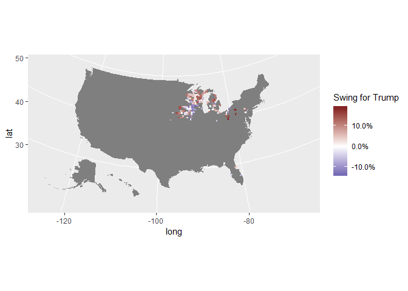<!-- -->

We plot each state independently

## Florida

``` r
county_2008 %>% filter(state_name == 'Florida') %>%
  ggplot(aes(long, lat, group = group, fill = trump_gain)) +
  geom_polygon(color = "#ffffff") +
  scale_fill_gradient2(labels = scales::percent,
                       low = muted('blue'),  mid = '#888888', na.value = 'gray80',
                       high = muted('red'), midpoint = 0,
                       guide = guide_colorbar(title.position = "top")) +
  coord_map(projection = "albers", lat0 = 39, lat1 = 45) +
  labs(fill = "Swing for Trump")
```

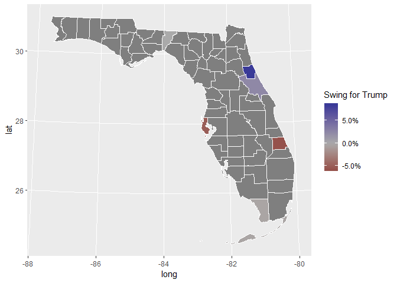<!-- -->

``` r
fl_2008 <- (data_2008 %>% filter(state == 'Florida'))
kable(fl_2008[order(-fl_2008$trump_gain),c('county','trump_gain')])
```

<table>

<thead>

<tr>

<th style="text-align:left;">

</th>

<th style="text-align:left;">

county

</th>

<th style="text-align:right;">

trump\_gain

</th>

</tr>

</thead>

<tbody>

<tr>

<td style="text-align:left;">

1

</td>

<td style="text-align:left;">

Flagler

</td>

<td style="text-align:right;">

0.0843717

</td>

</tr>

<tr>

<td style="text-align:left;">

6

</td>

<td style="text-align:left;">

Volusia

</td>

<td style="text-align:right;">

0.0240666

</td>

</tr>

<tr>

<td style="text-align:left;">

2

</td>

<td style="text-align:left;">

Jefferson

</td>

<td style="text-align:right;">

0.0003000

</td>

</tr>

<tr>

<td style="text-align:left;">

3

</td>

<td style="text-align:left;">

Monroe

</td>

<td style="text-align:right;">

\-0.0034897

</td>

</tr>

<tr>

<td style="text-align:left;">

4

</td>

<td style="text-align:left;">

Pinellas

</td>

<td style="text-align:right;">

\-0.0501735

</td>

</tr>

<tr>

<td style="text-align:left;">

5

</td>

<td style="text-align:left;">

St. Lucie

</td>

<td style="text-align:right;">

\-0.0576439

</td>

</tr>

</tbody>

</table>

## Iowa

``` r
county_2008 %>% filter(state_name == 'Iowa') %>%
  ggplot(aes(long, lat, group = group, fill = trump_gain)) +
  geom_polygon(color = "#ffffff") +
  scale_fill_gradient2(labels = scales::percent,
                       low = muted('blue'),  mid = '#888888', na.value = 'gray80',
                       high = muted('red'), midpoint = 0,
                       guide = guide_colorbar(title.position = "top")) +
  coord_map(projection = "albers", lat0 = 39, lat1 = 45) +
  labs(fill = "Swing for Trump")
```

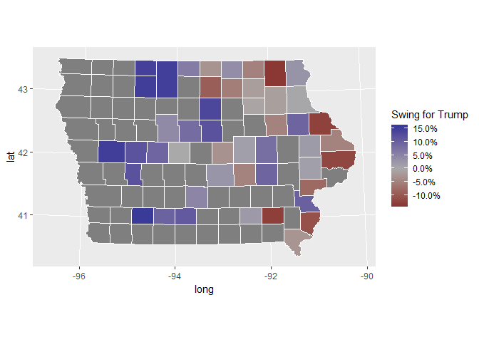<!-- -->

``` r
ia_2008 <- (data_2008 %>% filter(state == 'Iowa'))
kable(ia_2008[order(-ia_2008$trump_gain),c('county','trump_gain')])
```

<table>

<thead>

<tr>

<th style="text-align:left;">

</th>

<th style="text-align:left;">

county

</th>

<th style="text-align:right;">

trump\_gain

</th>

</tr>

</thead>

<tbody>

<tr>

<td style="text-align:left;">

1

</td>

<td style="text-align:left;">

Adams

</td>

<td style="text-align:right;">

0.1555935

</td>

</tr>

<tr>

<td style="text-align:left;">

38

</td>

<td style="text-align:left;">

Palo Alto

</td>

<td style="text-align:right;">

0.1499119

</td>

</tr>

<tr>

<td style="text-align:left;">

15

</td>

<td style="text-align:left;">

Crawford

</td>

<td style="text-align:right;">

0.1491354

</td>

</tr>

<tr>

<td style="text-align:left;">

32

</td>

<td style="text-align:left;">

Kossuth

</td>

<td style="text-align:right;">

0.1483816

</td>

</tr>

<tr>

<td style="text-align:left;">

19

</td>

<td style="text-align:left;">

Emmet

</td>

<td style="text-align:right;">

0.1448065

</td>

</tr>

<tr>

<td style="text-align:left;">

22

</td>

<td style="text-align:left;">

Franklin

</td>

<td style="text-align:right;">

0.1364805

</td>

</tr>

<tr>

<td style="text-align:left;">

25

</td>

<td style="text-align:left;">

Hardin

</td>

<td style="text-align:right;">

0.1198473

</td>

</tr>

<tr>

<td style="text-align:left;">

3

</td>

<td style="text-align:left;">

Audubon

</td>

<td style="text-align:right;">

0.1197667

</td>

</tr>

<tr>

<td style="text-align:left;">

8

</td>

<td style="text-align:left;">

Carroll

</td>

<td style="text-align:right;">

0.1191066

</td>

</tr>

<tr>

<td style="text-align:left;">

12

</td>

<td style="text-align:left;">

Clarke

</td>

<td style="text-align:right;">

0.1099032

</td>

</tr>

<tr>

<td style="text-align:left;">

34

</td>

<td style="text-align:left;">

Louisa

</td>

<td style="text-align:right;">

0.1000146

</td>

</tr>

<tr>

<td style="text-align:left;">

41

</td>

<td style="text-align:left;">

Union

</td>

<td style="text-align:right;">

0.0967237

</td>

</tr>

<tr>

<td style="text-align:left;">

16

</td>

<td style="text-align:left;">

Delaware

</td>

<td style="text-align:right;">

0.0938662

</td>

</tr>

<tr>

<td style="text-align:left;">

27

</td>

<td style="text-align:left;">

Iowa

</td>

<td style="text-align:right;">

0.0928767

</td>

</tr>

<tr>

<td style="text-align:left;">

23

</td>

<td style="text-align:left;">

Greene

</td>

<td style="text-align:right;">

0.0913938

</td>

</tr>

<tr>

<td style="text-align:left;">

24

</td>

<td style="text-align:left;">

Hamilton

</td>

<td style="text-align:right;">

0.0826620

</td>

</tr>

<tr>

<td style="text-align:left;">

4

</td>

<td style="text-align:left;">

Benton

</td>

<td style="text-align:right;">

0.0798942

</td>

</tr>

<tr>

<td style="text-align:left;">

45

</td>

<td style="text-align:left;">

Winnebago

</td>

<td style="text-align:right;">

0.0606240

</td>

</tr>

<tr>

<td style="text-align:left;">

43

</td>

<td style="text-align:left;">

Warren

</td>

<td style="text-align:right;">

0.0483046

</td>

</tr>

<tr>

<td style="text-align:left;">

44

</td>

<td style="text-align:left;">

Webster

</td>

<td style="text-align:right;">

0.0424424

</td>

</tr>

<tr>

<td style="text-align:left;">

36

</td>

<td style="text-align:left;">

Mitchell

</td>

<td style="text-align:right;">

0.0375514

</td>

</tr>

<tr>

<td style="text-align:left;">

2

</td>

<td style="text-align:left;">

Allamakee

</td>

<td style="text-align:right;">

0.0286734

</td>

</tr>

<tr>

<td style="text-align:left;">

29

</td>

<td style="text-align:left;">

Jasper

</td>

<td style="text-align:right;">

0.0270175

</td>

</tr>

<tr>

<td style="text-align:left;">

42

</td>

<td style="text-align:left;">

Wapello

</td>

<td style="text-align:right;">

0.0216479

</td>

</tr>

<tr>

<td style="text-align:left;">

31

</td>

<td style="text-align:left;">

Jones

</td>

<td style="text-align:right;">

0.0201100

</td>

</tr>

<tr>

<td style="text-align:left;">

9

</td>

<td style="text-align:left;">

Cedar

</td>

<td style="text-align:right;">

0.0147767

</td>

</tr>

<tr>

<td style="text-align:left;">

40

</td>

<td style="text-align:left;">

Tama

</td>

<td style="text-align:right;">

0.0144251

</td>

</tr>

<tr>

<td style="text-align:left;">

13

</td>

<td style="text-align:left;">

Clayton

</td>

<td style="text-align:right;">

0.0045010

</td>

</tr>

<tr>

<td style="text-align:left;">

5

</td>

<td style="text-align:left;">

Boone

</td>

<td style="text-align:right;">

\-0.0009161

</td>

</tr>

<tr>

<td style="text-align:left;">

6

</td>

<td style="text-align:left;">

Bremer

</td>

<td style="text-align:right;">

\-0.0067694

</td>

</tr>

<tr>

<td style="text-align:left;">

20

</td>

<td style="text-align:left;">

Fayette

</td>

<td style="text-align:right;">

\-0.0124761

</td>

</tr>

<tr>

<td style="text-align:left;">

11

</td>

<td style="text-align:left;">

Chickasaw

</td>

<td style="text-align:right;">

\-0.0144215

</td>

</tr>

<tr>

<td style="text-align:left;">

33

</td>

<td style="text-align:left;">

Lee

</td>

<td style="text-align:right;">

\-0.0251491

</td>

</tr>

<tr>

<td style="text-align:left;">

47

</td>

<td style="text-align:left;">

Worth

</td>

<td style="text-align:right;">

\-0.0267794

</td>

</tr>

<tr>

<td style="text-align:left;">

35

</td>

<td style="text-align:left;">

Marshall

</td>

<td style="text-align:right;">

\-0.0285483

</td>

</tr>

<tr>

<td style="text-align:left;">

39

</td>

<td style="text-align:left;">

Poweshiek

</td>

<td style="text-align:right;">

\-0.0471943

</td>

</tr>

<tr>

<td style="text-align:left;">

7

</td>

<td style="text-align:left;">

Buchanan

</td>

<td style="text-align:right;">

\-0.0477635

</td>

</tr>

<tr>

<td style="text-align:left;">

28

</td>

<td style="text-align:left;">

Jackson

</td>

<td style="text-align:right;">

\-0.0480699

</td>

</tr>

<tr>

<td style="text-align:left;">

26

</td>

<td style="text-align:left;">

Howard

</td>

<td style="text-align:right;">

\-0.0493256

</td>

</tr>

<tr>

<td style="text-align:left;">

21

</td>

<td style="text-align:left;">

Floyd

</td>

<td style="text-align:right;">

\-0.0531669

</td>

</tr>

<tr>

<td style="text-align:left;">

37

</td>

<td style="text-align:left;">

Muscatine

</td>

<td style="text-align:right;">

\-0.0780033

</td>

</tr>

<tr>

<td style="text-align:left;">

10

</td>

<td style="text-align:left;">

Cerro Gordo

</td>

<td style="text-align:right;">

\-0.0906965

</td>

</tr>

<tr>

<td style="text-align:left;">

17

</td>

<td style="text-align:left;">

Des Moines

</td>

<td style="text-align:right;">

\-0.1070116

</td>

</tr>

<tr>

<td style="text-align:left;">

14

</td>

<td style="text-align:left;">

Clinton

</td>

<td style="text-align:right;">

\-0.1187120

</td>

</tr>

<tr>

<td style="text-align:left;">

18

</td>

<td style="text-align:left;">

Dubuque

</td>

<td style="text-align:right;">

\-0.1248139

</td>

</tr>

<tr>

<td style="text-align:left;">

30

</td>

<td style="text-align:left;">

Jefferson

</td>

<td style="text-align:right;">

\-0.1278785

</td>

</tr>

<tr>

<td style="text-align:left;">

46

</td>

<td style="text-align:left;">

Winneshiek

</td>

<td style="text-align:right;">

\-0.1350681

</td>

</tr>

</tbody>

</table>

## Michigan

``` r
county_2008 %>% filter(state_name == 'Michigan') %>%
  ggplot(aes(long, lat, group = group, fill = trump_gain)) +
  geom_polygon(color = "#ffffff") +
  scale_fill_gradient2(labels = scales::percent,
                       low = muted('blue'),  mid = '#888888', na.value = 'gray80',
                       high = muted('red'), midpoint = 0,
                       guide = guide_colorbar(title.position = "top")) +
  coord_map(projection = "albers", lat0 = 39, lat1 = 45) +
  labs(fill = "Swing for Trump")
```

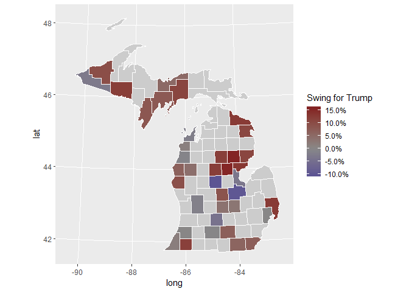<!-- -->

``` r
mi_2008 <- (data_2008 %>% filter(state == 'Michigan'))
kable(mi_2008[order(-mi_2008$trump_gain),c('county','trump_gain')])
```

<table>

<thead>

<tr>

<th style="text-align:left;">

</th>

<th style="text-align:left;">

county

</th>

<th style="text-align:right;">

trump\_gain

</th>

</tr>

</thead>

<tbody>

<tr>

<td style="text-align:left;">

30

</td>

<td style="text-align:left;">

Ogemaw

</td>

<td style="text-align:right;">

0.1566138

</td>

</tr>

<tr>

<td style="text-align:left;">

13

</td>

<td style="text-align:left;">

Gladwin

</td>

<td style="text-align:right;">

0.1536825

</td>

</tr>

<tr>

<td style="text-align:left;">

3

</td>

<td style="text-align:left;">

Arenac

</td>

<td style="text-align:right;">

0.1319954

</td>

</tr>

<tr>

<td style="text-align:left;">

37

</td>

<td style="text-align:left;">

St. Clair

</td>

<td style="text-align:right;">

0.1260289

</td>

</tr>

<tr>

<td style="text-align:left;">

32

</td>

<td style="text-align:left;">

Presque Isle

</td>

<td style="text-align:right;">

0.1258428

</td>

</tr>

<tr>

<td style="text-align:left;">

17

</td>

<td style="text-align:left;">

Iron

</td>

<td style="text-align:right;">

0.1219897

</td>

</tr>

<tr>

<td style="text-align:left;">

9

</td>

<td style="text-align:left;">

Clare

</td>

<td style="text-align:right;">

0.1206352

</td>

</tr>

<tr>

<td style="text-align:left;">

33

</td>

<td style="text-align:left;">

Roscommon

</td>

<td style="text-align:right;">

0.1202409

</td>

</tr>

<tr>

<td style="text-align:left;">

8

</td>

<td style="text-align:left;">

Cass

</td>

<td style="text-align:right;">

0.1178480

</td>

</tr>

<tr>

<td style="text-align:left;">

35

</td>

<td style="text-align:left;">

Schoolcraft

</td>

<td style="text-align:right;">

0.1104562

</td>

</tr>

<tr>

<td style="text-align:left;">

16

</td>

<td style="text-align:left;">

Iosco

</td>

<td style="text-align:right;">

0.1093890

</td>

</tr>

<tr>

<td style="text-align:left;">

2

</td>

<td style="text-align:left;">

Alpena

</td>

<td style="text-align:right;">

0.1076792

</td>

</tr>

<tr>

<td style="text-align:left;">

31

</td>

<td style="text-align:left;">

Ontonagon

</td>

<td style="text-align:right;">

0.0969867

</td>

</tr>

<tr>

<td style="text-align:left;">

29

</td>

<td style="text-align:left;">

Oceana

</td>

<td style="text-align:right;">

0.0938362

</td>

</tr>

<tr>

<td style="text-align:left;">

15

</td>

<td style="text-align:left;">

Gratiot

</td>

<td style="text-align:right;">

0.0867560

</td>

</tr>

<tr>

<td style="text-align:left;">

27

</td>

<td style="text-align:left;">

Menominee

</td>

<td style="text-align:right;">

0.0822082

</td>

</tr>

<tr>

<td style="text-align:left;">

11

</td>

<td style="text-align:left;">

Delta

</td>

<td style="text-align:right;">

0.0782101

</td>

</tr>

<tr>

<td style="text-align:left;">

28

</td>

<td style="text-align:left;">

Monroe

</td>

<td style="text-align:right;">

0.0702113

</td>

</tr>

<tr>

<td style="text-align:left;">

19

</td>

<td style="text-align:left;">

Jackson

</td>

<td style="text-align:right;">

0.0680397

</td>

</tr>

<tr>

<td style="text-align:left;">

26

</td>

<td style="text-align:left;">

Mason

</td>

<td style="text-align:right;">

0.0656631

</td>

</tr>

<tr>

<td style="text-align:left;">

23

</td>

<td style="text-align:left;">

Lenawee

</td>

<td style="text-align:right;">

0.0591342

</td>

</tr>

<tr>

<td style="text-align:left;">

1

</td>

<td style="text-align:left;">

Alger

</td>

<td style="text-align:right;">

0.0517348

</td>

</tr>

<tr>

<td style="text-align:left;">

21

</td>

<td style="text-align:left;">

Lake

</td>

<td style="text-align:right;">

0.0413181

</td>

</tr>

<tr>

<td style="text-align:left;">

10

</td>

<td style="text-align:left;">

Clinton

</td>

<td style="text-align:right;">

0.0367792

</td>

</tr>

<tr>

<td style="text-align:left;">

36

</td>

<td style="text-align:left;">

Shiawassee

</td>

<td style="text-align:right;">

0.0310827

</td>

</tr>

<tr>

<td style="text-align:left;">

6

</td>

<td style="text-align:left;">

Berrien

</td>

<td style="text-align:right;">

0.0166014

</td>

</tr>

<tr>

<td style="text-align:left;">

5

</td>

<td style="text-align:left;">

Benzie

</td>

<td style="text-align:right;">

0.0127913

</td>

</tr>

<tr>

<td style="text-align:left;">

38

</td>

<td style="text-align:left;">

Van Buren

</td>

<td style="text-align:right;">

0.0029967

</td>

</tr>

<tr>

<td style="text-align:left;">

24

</td>

<td style="text-align:left;">

Macomb

</td>

<td style="text-align:right;">

0.0019788

</td>

</tr>

<tr>

<td style="text-align:left;">

7

</td>

<td style="text-align:left;">

Calhoun

</td>

<td style="text-align:right;">

\-0.0036821

</td>

</tr>

<tr>

<td style="text-align:left;">

25

</td>

<td style="text-align:left;">

Manistee

</td>

<td style="text-align:right;">

\-0.0073003

</td>

</tr>

<tr>

<td style="text-align:left;">

20

</td>

<td style="text-align:left;">

Kent

</td>

<td style="text-align:right;">

\-0.0135491

</td>

</tr>

<tr>

<td style="text-align:left;">

22

</td>

<td style="text-align:left;">

Leelanau

</td>

<td style="text-align:right;">

\-0.0179570

</td>

</tr>

<tr>

<td style="text-align:left;">

14

</td>

<td style="text-align:left;">

Gogebic

</td>

<td style="text-align:right;">

\-0.0273962

</td>

</tr>

<tr>

<td style="text-align:left;">

4

</td>

<td style="text-align:left;">

Bay

</td>

<td style="text-align:right;">

\-0.0327532

</td>

</tr>

<tr>

<td style="text-align:left;">

12

</td>

<td style="text-align:left;">

Eaton

</td>

<td style="text-align:right;">

\-0.0424872

</td>

</tr>

<tr>

<td style="text-align:left;">

34

</td>

<td style="text-align:left;">

Saginaw

</td>

<td style="text-align:right;">

\-0.0970041

</td>

</tr>

<tr>

<td style="text-align:left;">

18

</td>

<td style="text-align:left;">

Isabella

</td>

<td style="text-align:right;">

\-0.1024234

</td>

</tr>

</tbody>

</table>

## Nebraska

``` r
county_2008 %>% filter(state_name == 'Nebraska') %>%
  ggplot(aes(long, lat, group = group, fill = trump_gain)) +
  geom_polygon(color = "#ffffff") +
  scale_fill_gradient2(labels = scales::percent,
                       low = muted('blue'),  mid = '#888888', na.value = 'gray80',
                       high = muted('red'), midpoint = 0,
                       guide = guide_colorbar(title.position = "top")) +
  coord_map(projection = "albers", lat0 = 39, lat1 = 45) +
  labs(fill = "Swing for Trump")
```

<!-- -->

``` r
ne_2008 <- (data_2008 %>% filter(state == 'Nebraska'))
kable(ne_2008[order(-ne_2008$trump_gain),c('county','trump_gain')])
```

<table>

<thead>

<tr>

<th style="text-align:left;">

county

</th>

<th style="text-align:right;">

trump\_gain

</th>

</tr>

</thead>

<tbody>

<tr>

<td style="text-align:left;">

Saline

</td>

<td style="text-align:right;">

0.0756546

</td>

</tr>

<tr>

<td style="text-align:left;">

Thurston

</td>

<td style="text-align:right;">

\-0.0272898

</td>

</tr>

</tbody>

</table>

## Ohio

``` r
county_2008 %>% filter(state_name == 'Ohio') %>%
  ggplot(aes(long, lat, group = group, fill = trump_gain)) +
  geom_polygon(color = "#ffffff") +
  scale_fill_gradient2(labels = scales::percent,
                       low = muted('blue'),  mid = '#888888', na.value = 'gray80',
                       high = muted('red'), midpoint = 0,
                       guide = guide_colorbar(title.position = "top")) +
  coord_map(projection = "albers", lat0 = 39, lat1 = 45) +
  labs(fill = "Swing for Trump")
```

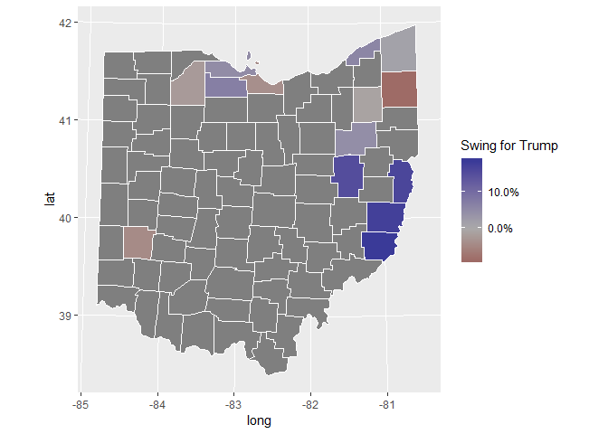<!-- -->

``` r
oh_2008 <- (data_2008 %>% filter(state == 'Ohio'))
kable(oh_2008[order(-oh_2008$trump_gain),c('county','trump_gain')])
```

<table>

<thead>

<tr>

<th style="text-align:left;">

</th>

<th style="text-align:left;">

county

</th>

<th style="text-align:right;">

trump\_gain

</th>

</tr>

</thead>

<tbody>

<tr>

<td style="text-align:left;">

6

</td>

<td style="text-align:left;">

Monroe

</td>

<td style="text-align:right;">

0.1857589

</td>

</tr>

<tr>

<td style="text-align:left;">

2

</td>

<td style="text-align:left;">

Belmont

</td>

<td style="text-align:right;">

0.1752567

</td>

</tr>

<tr>

<td style="text-align:left;">

4

</td>

<td style="text-align:left;">

Jefferson

</td>

<td style="text-align:right;">

0.1650945

</td>

</tr>

<tr>

<td style="text-align:left;">

13

</td>

<td style="text-align:left;">

Tuscarawas

</td>

<td style="text-align:right;">

0.1514057

</td>

</tr>

<tr>

<td style="text-align:left;">

10

</td>

<td style="text-align:left;">

Sandusky

</td>

<td style="text-align:right;">

0.0681530

</td>

</tr>

<tr>

<td style="text-align:left;">

5

</td>

<td style="text-align:left;">

Lake

</td>

<td style="text-align:right;">

0.0569740

</td>

</tr>

<tr>

<td style="text-align:left;">

8

</td>

<td style="text-align:left;">

Ottawa

</td>

<td style="text-align:right;">

0.0471905

</td>

</tr>

<tr>

<td style="text-align:left;">

11

</td>

<td style="text-align:left;">

Stark

</td>

<td style="text-align:right;">

0.0442945

</td>

</tr>

<tr>

<td style="text-align:left;">

1

</td>

<td style="text-align:left;">

Ashtabula

</td>

<td style="text-align:right;">

0.0128655

</td>

</tr>

<tr>

<td style="text-align:left;">

9

</td>

<td style="text-align:left;">

Portage

</td>

<td style="text-align:right;">

\-0.0102347

</td>

</tr>

<tr>

<td style="text-align:left;">

14

</td>

<td style="text-align:left;">

Wood

</td>

<td style="text-align:right;">

\-0.0221849

</td>

</tr>

<tr>

<td style="text-align:left;">

3

</td>

<td style="text-align:left;">

Erie

</td>

<td style="text-align:right;">

\-0.0385903

</td>

</tr>

<tr>

<td style="text-align:left;">

7

</td>

<td style="text-align:left;">

Montgomery

</td>

<td style="text-align:right;">

\-0.0444977

</td>

</tr>

<tr>

<td style="text-align:left;">

12

</td>

<td style="text-align:left;">

Trumbull

</td>

<td style="text-align:right;">

\-0.0896017

</td>

</tr>

</tbody>

</table>

## Pennsylvania

``` r
county_2008 %>% filter(state_name == 'Pennsylvania') %>%
  ggplot(aes(long, lat, group = group, fill = trump_gain)) +
  geom_polygon(color = "#ffffff") +
  scale_fill_gradient2(labels = scales::percent,
                       low = muted('blue'),  mid = '#888888', na.value = 'gray80',
                       high = muted('red'), midpoint = 0,
                       guide = guide_colorbar(title.position = "top")) +
  coord_map(projection = "albers", lat0 = 39, lat1 = 45) +
  labs(fill = "Swing for Trump")
```

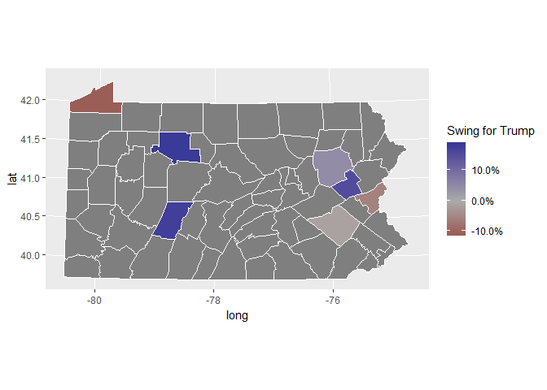<!-- -->

``` r
pa_2008 <- (data_2008 %>% filter(state == 'Pennsylvania'))
kable(pa_2008[order(-pa_2008$trump_gain),c('county','trump_gain')])
```

<table>

<thead>

<tr>

<th style="text-align:left;">

</th>

<th style="text-align:left;">

county

</th>

<th style="text-align:right;">

trump\_gain

</th>

</tr>

</thead>

<tbody>

<tr>

<td style="text-align:left;">

4

</td>

<td style="text-align:left;">

Elk

</td>

<td style="text-align:right;">

0.1836339

</td>

</tr>

<tr>

<td style="text-align:left;">

2

</td>

<td style="text-align:left;">

Cambria

</td>

<td style="text-align:right;">

0.1754822

</td>

</tr>

<tr>

<td style="text-align:left;">

3

</td>

<td style="text-align:left;">

Carbon

</td>

<td style="text-align:right;">

0.1511742

</td>

</tr>

<tr>

<td style="text-align:left;">

6

</td>

<td style="text-align:left;">

Luzerne

</td>

<td style="text-align:right;">

0.0466173

</td>

</tr>

<tr>

<td style="text-align:left;">

1

</td>

<td style="text-align:left;">

Berks

</td>

<td style="text-align:right;">

\-0.0116382

</td>

</tr>

<tr>

<td style="text-align:left;">

7

</td>

<td style="text-align:left;">

Northampton

</td>

<td style="text-align:right;">

\-0.0552194

</td>

</tr>

<tr>

<td style="text-align:left;">

5

</td>

<td style="text-align:left;">

Erie

</td>

<td style="text-align:right;">

\-0.1079678

</td>

</tr>

</tbody>

</table>

## Wisconsin

``` r
county_2008 %>% filter(state_name == 'Wisconsin') %>%
  ggplot(aes(long, lat, group = group, fill = trump_gain)) +
  geom_polygon(color = "#ffffff") +
  scale_fill_gradient2(labels = scales::percent,
                       low = muted('blue'),  mid = '#888888', na.value = 'gray80',
                       high = muted('red'), midpoint = 0,
                       guide = guide_colorbar(title.position = "top")) +
  coord_map(projection = "albers", lat0 = 39, lat1 = 45) +
  labs(fill = "Swing for Trump")
```

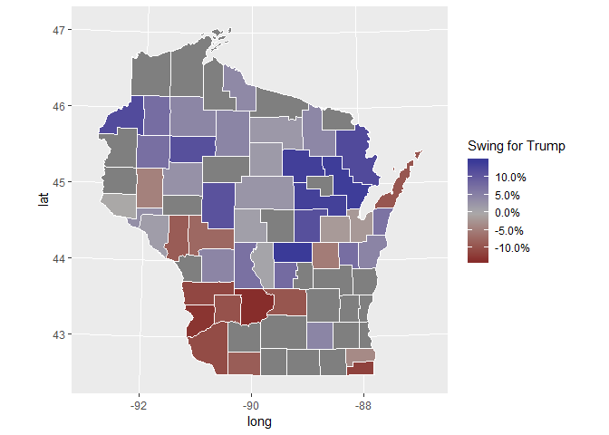<!-- -->

``` r
wi_2008 <- (data_2008 %>% filter(state == 'Wisconsin'))
kable(wi_2008[order(-wi_2008$trump_gain),c('county','trump_gain')])
```

<table>

<thead>

<tr>

<th style="text-align:left;">

</th>

<th style="text-align:left;">

county

</th>

<th style="text-align:right;">

trump\_gain

</th>

</tr>

</thead>

<tbody>

<tr>

<td style="text-align:left;">

45

</td>

<td style="text-align:left;">

Waushara

</td>

<td style="text-align:right;">

0.1439049

</td>

</tr>

<tr>

<td style="text-align:left;">

29

</td>

<td style="text-align:left;">

Oconto

</td>

<td style="text-align:right;">

0.1400246

</td>

</tr>

<tr>

<td style="text-align:left;">

22

</td>

<td style="text-align:left;">

Langlade

</td>

<td style="text-align:right;">

0.1370417

</td>

</tr>

<tr>

<td style="text-align:left;">

40

</td>

<td style="text-align:left;">

Shawano

</td>

<td style="text-align:right;">

0.1344544

</td>

</tr>

<tr>

<td style="text-align:left;">

26

</td>

<td style="text-align:left;">

Marinette

</td>

<td style="text-align:right;">

0.1215594

</td>

</tr>

<tr>

<td style="text-align:left;">

5

</td>

<td style="text-align:left;">

Burnett

</td>

<td style="text-align:right;">

0.1198152

</td>

</tr>

<tr>

<td style="text-align:left;">

44

</td>

<td style="text-align:left;">

Waupaca

</td>

<td style="text-align:right;">

0.1143771

</td>

</tr>

<tr>

<td style="text-align:left;">

37

</td>

<td style="text-align:left;">

Rusk

</td>

<td style="text-align:right;">

0.1138805

</td>

</tr>

<tr>

<td style="text-align:left;">

8

</td>

<td style="text-align:left;">

Clark

</td>

<td style="text-align:right;">

0.1105117

</td>

</tr>

<tr>

<td style="text-align:left;">

27

</td>

<td style="text-align:left;">

Marquette

</td>

<td style="text-align:right;">

0.0787573

</td>

</tr>

<tr>

<td style="text-align:left;">

43

</td>

<td style="text-align:left;">

Washburn

</td>

<td style="text-align:right;">

0.0756951

</td>

</tr>

<tr>

<td style="text-align:left;">

6

</td>

<td style="text-align:left;">

Calumet

</td>

<td style="text-align:right;">

0.0737191

</td>

</tr>

<tr>

<td style="text-align:left;">

2

</td>

<td style="text-align:left;">

Barron

</td>

<td style="text-align:right;">

0.0731459

</td>

</tr>

<tr>

<td style="text-align:left;">

18

</td>

<td style="text-align:left;">

Juneau

</td>

<td style="text-align:right;">

0.0706294

</td>

</tr>

<tr>

<td style="text-align:left;">

20

</td>

<td style="text-align:left;">

Kewaunee

</td>

<td style="text-align:right;">

0.0678441

</td>

</tr>

<tr>

<td style="text-align:left;">

24

</td>

<td style="text-align:left;">

Manitowoc

</td>

<td style="text-align:right;">

0.0460649

</td>

</tr>

<tr>

<td style="text-align:left;">

17

</td>

<td style="text-align:left;">

Jefferson

</td>

<td style="text-align:right;">

0.0457038

</td>

</tr>

<tr>

<td style="text-align:left;">

34

</td>

<td style="text-align:left;">

Price

</td>

<td style="text-align:right;">

0.0457025

</td>

</tr>

<tr>

<td style="text-align:left;">

28

</td>

<td style="text-align:left;">

Monroe

</td>

<td style="text-align:right;">

0.0446455

</td>

</tr>

<tr>

<td style="text-align:left;">

39

</td>

<td style="text-align:left;">

Sawyer

</td>

<td style="text-align:right;">

0.0439775

</td>

</tr>

<tr>

<td style="text-align:left;">

13

</td>

<td style="text-align:left;">

Forest

</td>

<td style="text-align:right;">

0.0433090

</td>

</tr>

<tr>

<td style="text-align:left;">

15

</td>

<td style="text-align:left;">

Iron

</td>

<td style="text-align:right;">

0.0399628

</td>

</tr>

<tr>

<td style="text-align:left;">

32

</td>

<td style="text-align:left;">

Pepin

</td>

<td style="text-align:right;">

0.0325855

</td>

</tr>

<tr>

<td style="text-align:left;">

7

</td>

<td style="text-align:left;">

Chippewa

</td>

<td style="text-align:right;">

0.0302770

</td>

</tr>

<tr>

<td style="text-align:left;">

25

</td>

<td style="text-align:left;">

Marathon

</td>

<td style="text-align:right;">

0.0259359

</td>

</tr>

<tr>

<td style="text-align:left;">

30

</td>

<td style="text-align:left;">

Oneida

</td>

<td style="text-align:right;">

0.0212609

</td>

</tr>

<tr>

<td style="text-align:left;">

23

</td>

<td style="text-align:left;">

Lincoln

</td>

<td style="text-align:right;">

0.0194532

</td>

</tr>

<tr>

<td style="text-align:left;">

4

</td>

<td style="text-align:left;">

Buffalo

</td>

<td style="text-align:right;">

0.0152790

</td>

</tr>

<tr>

<td style="text-align:left;">

47

</td>

<td style="text-align:left;">

Wood

</td>

<td style="text-align:right;">

0.0129370

</td>

</tr>

<tr>

<td style="text-align:left;">

1

</td>

<td style="text-align:left;">

Adams

</td>

<td style="text-align:right;">

0.0072322

</td>

</tr>

<tr>

<td style="text-align:left;">

33

</td>

<td style="text-align:left;">

Pierce

</td>

<td style="text-align:right;">

\-0.0025899

</td>

</tr>

<tr>

<td style="text-align:left;">

31

</td>

<td style="text-align:left;">

Outagamie

</td>

<td style="text-align:right;">

\-0.0178559

</td>

</tr>

<tr>

<td style="text-align:left;">

3

</td>

<td style="text-align:left;">

Brown

</td>

<td style="text-align:right;">

\-0.0182059

</td>

</tr>

<tr>

<td style="text-align:left;">

35

</td>

<td style="text-align:left;">

Racine

</td>

<td style="text-align:right;">

\-0.0355120

</td>

</tr>

<tr>

<td style="text-align:left;">

12

</td>

<td style="text-align:left;">

Dunn

</td>

<td style="text-align:right;">

\-0.0455441

</td>

</tr>

<tr>

<td style="text-align:left;">

46

</td>

<td style="text-align:left;">

Winnebago

</td>

<td style="text-align:right;">

\-0.0507916

</td>

</tr>

<tr>

<td style="text-align:left;">

16

</td>

<td style="text-align:left;">

Jackson

</td>

<td style="text-align:right;">

\-0.0730855

</td>

</tr>

<tr>

<td style="text-align:left;">

21

</td>

<td style="text-align:left;">

Lafayette

</td>

<td style="text-align:right;">

\-0.0852100

</td>

</tr>

<tr>

<td style="text-align:left;">

41

</td>

<td style="text-align:left;">

Trempealeau

</td>

<td style="text-align:right;">

\-0.0864803

</td>

</tr>

<tr>

<td style="text-align:left;">

11

</td>

<td style="text-align:left;">

Door

</td>

<td style="text-align:right;">

\-0.0926671

</td>

</tr>

<tr>

<td style="text-align:left;">

9

</td>

<td style="text-align:left;">

Columbia

</td>

<td style="text-align:right;">

\-0.0935481

</td>

</tr>

<tr>

<td style="text-align:left;">

36

</td>

<td style="text-align:left;">

Richland

</td>

<td style="text-align:right;">

\-0.0971267

</td>

</tr>

<tr>

<td style="text-align:left;">

14

</td>

<td style="text-align:left;">

Grant

</td>

<td style="text-align:right;">

\-0.1038860

</td>

</tr>

<tr>

<td style="text-align:left;">

42

</td>

<td style="text-align:left;">

Vernon

</td>

<td style="text-align:right;">

\-0.1090534

</td>

</tr>

<tr>

<td style="text-align:left;">

19

</td>

<td style="text-align:left;">

Kenosha

</td>

<td style="text-align:right;">

\-0.1143605

</td>

</tr>

<tr>

<td style="text-align:left;">

10

</td>

<td style="text-align:left;">

Crawford

</td>

<td style="text-align:right;">

\-0.1284747

</td>

</tr>

<tr>

<td style="text-align:left;">

38

</td>

<td style="text-align:left;">

Sauk

</td>

<td style="text-align:right;">

\-0.1355979

</td>

</tr>

</tbody>

</table>

# Plots for the 2012 Results

And the comparison for 2012
results

``` r
trump_intersect_2012 <- counties_trump_won[counties_trump_won$state %in% counties_obama_won_2012$state & counties_trump_won$county %in% counties_obama_won_2012$county,]
obama_intersect_2012 <- counties_obama_won_2012[counties_obama_won_2012$state %in% counties_trump_won$state & counties_obama_won_2012$county %in% counties_trump_won$county,]

compare_2012 <- merge(obama_intersect_2012, trump_intersect_2012, by=c('state','county','FIPS'))
compare_2012$trump_gain <- compare_2012$votepercentage.y - compare_2012$votepercentage.x

data_2012 <- compare_2012[which(compare_2012$trump_gain > 0),c('state','county','FIPS','trump_gain')]
```

There were `nrow(data_2012)` counties which flipped from Obama 2012 to
Trump in 2016:

``` r
kable(data_2012[order(-data_2012$trump_gain),])
```

<table>

<thead>

<tr>

<th style="text-align:left;">

</th>

<th style="text-align:left;">

state

</th>

<th style="text-align:left;">

county

</th>

<th style="text-align:right;">

FIPS

</th>

<th style="text-align:right;">

trump\_gain

</th>

</tr>

</thead>

<tbody>

<tr>

<td style="text-align:left;">

25

</td>

<td style="text-align:left;">

Iowa

</td>

<td style="text-align:left;">

Louisa

</td>

<td style="text-align:right;">

19115

</td>

<td style="text-align:right;">

0.1192607

</td>

</tr>

<tr>

<td style="text-align:left;">

12

</td>

<td style="text-align:left;">

Iowa

</td>

<td style="text-align:left;">

Clarke

</td>

<td style="text-align:right;">

19039

</td>

<td style="text-align:right;">

0.1149845

</td>

</tr>

<tr>

<td style="text-align:left;">

77

</td>

<td style="text-align:left;">

Wisconsin

</td>

<td style="text-align:left;">

Price

</td>

<td style="text-align:right;">

55099

</td>

<td style="text-align:right;">

0.1101222

</td>

</tr>

<tr>

<td style="text-align:left;">

75

</td>

<td style="text-align:left;">

Wisconsin

</td>

<td style="text-align:left;">

Marquette

</td>

<td style="text-align:right;">

55077

</td>

<td style="text-align:right;">

0.1019882

</td>

</tr>

<tr>

<td style="text-align:left;">

31

</td>

<td style="text-align:left;">

Iowa

</td>

<td style="text-align:left;">

Union

</td>

<td style="text-align:right;">

19175

</td>

<td style="text-align:right;">

0.0935963

</td>

</tr>

<tr>

<td style="text-align:left;">

68

</td>

<td style="text-align:left;">

Wisconsin

</td>

<td style="text-align:left;">

Forest

</td>

<td style="text-align:right;">

55041

</td>

<td style="text-align:right;">

0.0923671

</td>

</tr>

<tr>

<td style="text-align:left;">

45

</td>

<td style="text-align:left;">

Michigan

</td>

<td style="text-align:left;">

Monroe

</td>

<td style="text-align:right;">

26115

</td>

<td style="text-align:right;">

0.0844901

</td>

</tr>

<tr>

<td style="text-align:left;">

76

</td>

<td style="text-align:left;">

Wisconsin

</td>

<td style="text-align:left;">

Pepin

</td>

<td style="text-align:right;">

55091

</td>

<td style="text-align:right;">

0.0828332

</td>

</tr>

<tr>

<td style="text-align:left;">

27

</td>

<td style="text-align:left;">

Iowa

</td>

<td style="text-align:left;">

Mitchell

</td>

<td style="text-align:right;">

19131

</td>

<td style="text-align:right;">

0.0820841

</td>

</tr>

<tr>

<td style="text-align:left;">

55

</td>

<td style="text-align:left;">

Ohio

</td>

<td style="text-align:left;">

Sandusky

</td>

<td style="text-align:right;">

39143

</td>

<td style="text-align:right;">

0.0802825

</td>

</tr>

<tr>

<td style="text-align:left;">

71

</td>

<td style="text-align:left;">

Wisconsin

</td>

<td style="text-align:left;">

Juneau

</td>

<td style="text-align:right;">

55057

</td>

<td style="text-align:right;">

0.0793674

</td>

</tr>

<tr>

<td style="text-align:left;">

5

</td>

<td style="text-align:left;">

Iowa

</td>

<td style="text-align:left;">

Allamakee

</td>

<td style="text-align:right;">

19005

</td>

<td style="text-align:right;">

0.0788150

</td>

</tr>

<tr>

<td style="text-align:left;">

74

</td>

<td style="text-align:left;">

Wisconsin

</td>

<td style="text-align:left;">

Lincoln

</td>

<td style="text-align:right;">

55069

</td>

<td style="text-align:right;">

0.0741528

</td>

</tr>

<tr>

<td style="text-align:left;">

42

</td>

<td style="text-align:left;">

Michigan

</td>

<td style="text-align:left;">

Lake

</td>

<td style="text-align:right;">

26085

</td>

<td style="text-align:right;">

0.0723834

</td>

</tr>

<tr>

<td style="text-align:left;">

63

</td>

<td style="text-align:left;">

Wisconsin

</td>

<td style="text-align:left;">

Buffalo

</td>

<td style="text-align:right;">

55011

</td>

<td style="text-align:right;">

0.0722476

</td>

</tr>

<tr>

<td style="text-align:left;">

81

</td>

<td style="text-align:left;">

Wisconsin

</td>

<td style="text-align:left;">

Sawyer

</td>

<td style="text-align:right;">

55113

</td>

<td style="text-align:right;">

0.0714047

</td>

</tr>

<tr>

<td style="text-align:left;">

35

</td>

<td style="text-align:left;">

Iowa

</td>

<td style="text-align:left;">

Woodbury

</td>

<td style="text-align:right;">

19193

</td>

<td style="text-align:right;">

0.0702114

</td>

</tr>

<tr>

<td style="text-align:left;">

56

</td>

<td style="text-align:left;">

Ohio

</td>

<td style="text-align:left;">

Stark

</td>

<td style="text-align:right;">

39151

</td>

<td style="text-align:right;">

0.0686496

</td>

</tr>

<tr>

<td style="text-align:left;">

60

</td>

<td style="text-align:left;">

Pennsylvania

</td>

<td style="text-align:left;">

Luzerne

</td>

<td style="text-align:right;">

42079

</td>

<td style="text-align:right;">

0.0661722

</td>

</tr>

<tr>

<td style="text-align:left;">

53

</td>

<td style="text-align:left;">

Ohio

</td>

<td style="text-align:left;">

Ottawa

</td>

<td style="text-align:right;">

39123

</td>

<td style="text-align:right;">

0.0572470

</td>

</tr>

<tr>

<td style="text-align:left;">

13

</td>

<td style="text-align:left;">

Iowa

</td>

<td style="text-align:left;">

Clayton

</td>

<td style="text-align:right;">

19043

</td>

<td style="text-align:right;">

0.0564940

</td>

</tr>

<tr>

<td style="text-align:left;">

33

</td>

<td style="text-align:left;">

Iowa

</td>

<td style="text-align:left;">

Webster

</td>

<td style="text-align:right;">

19187

</td>

<td style="text-align:right;">

0.0555609

</td>

</tr>

<tr>

<td style="text-align:left;">

47

</td>

<td style="text-align:left;">

Michigan

</td>

<td style="text-align:left;">

Shiawassee

</td>

<td style="text-align:right;">

26155

</td>

<td style="text-align:right;">

0.0531328

</td>

</tr>

<tr>

<td style="text-align:left;">

62

</td>

<td style="text-align:left;">

Wisconsin

</td>

<td style="text-align:left;">

Adams

</td>

<td style="text-align:right;">

55001

</td>

<td style="text-align:right;">

0.0499080

</td>

</tr>

<tr>

<td style="text-align:left;">

48

</td>

<td style="text-align:left;">

Michigan

</td>

<td style="text-align:left;">

Van Buren

</td>

<td style="text-align:right;">

26159

</td>

<td style="text-align:right;">

0.0415703

</td>

</tr>

<tr>

<td style="text-align:left;">

9

</td>

<td style="text-align:left;">

Iowa

</td>

<td style="text-align:left;">

Cedar

</td>

<td style="text-align:right;">

19031

</td>

<td style="text-align:right;">

0.0396867

</td>

</tr>

<tr>

<td style="text-align:left;">

30

</td>

<td style="text-align:left;">

Iowa

</td>

<td style="text-align:left;">

Tama

</td>

<td style="text-align:right;">

19171

</td>

<td style="text-align:right;">

0.0392055

</td>

</tr>

<tr>

<td style="text-align:left;">

23

</td>

<td style="text-align:left;">

Iowa

</td>

<td style="text-align:left;">

Jones

</td>

<td style="text-align:right;">

19105

</td>

<td style="text-align:right;">

0.0348722

</td>

</tr>

<tr>

<td style="text-align:left;">

11

</td>

<td style="text-align:left;">

Iowa

</td>

<td style="text-align:left;">

Chickasaw

</td>

<td style="text-align:right;">

19037

</td>

<td style="text-align:right;">

0.0333889

</td>

</tr>

<tr>

<td style="text-align:left;">

38

</td>

<td style="text-align:left;">

Michigan

</td>

<td style="text-align:left;">

Calhoun

</td>

<td style="text-align:right;">

26025

</td>

<td style="text-align:right;">

0.0329103

</td>

</tr>

<tr>

<td style="text-align:left;">

21

</td>

<td style="text-align:left;">

Iowa

</td>

<td style="text-align:left;">

Jasper

</td>

<td style="text-align:right;">

19099

</td>

<td style="text-align:right;">

0.0292010

</td>

</tr>

<tr>

<td style="text-align:left;">

44

</td>

<td style="text-align:left;">

Michigan

</td>

<td style="text-align:left;">

Manistee

</td>

<td style="text-align:right;">

26101

</td>

<td style="text-align:right;">

0.0269211

</td>

</tr>

<tr>

<td style="text-align:left;">

32

</td>

<td style="text-align:left;">

Iowa

</td>

<td style="text-align:left;">

Wapello

</td>

<td style="text-align:right;">

19179

</td>

<td style="text-align:right;">

0.0259513

</td>

</tr>

<tr>

<td style="text-align:left;">

7

</td>

<td style="text-align:left;">

Iowa

</td>

<td style="text-align:left;">

Bremer

</td>

<td style="text-align:right;">

19017

</td>

<td style="text-align:right;">

0.0256836

</td>

</tr>

<tr>

<td style="text-align:left;">

43

</td>

<td style="text-align:left;">

Michigan

</td>

<td style="text-align:left;">

Macomb

</td>

<td style="text-align:right;">

26099

</td>

<td style="text-align:right;">

0.0210128

</td>

</tr>

<tr>

<td style="text-align:left;">

2

</td>

<td style="text-align:left;">

Florida

</td>

<td style="text-align:left;">

Monroe

</td>

<td style="text-align:right;">

12087

</td>

<td style="text-align:right;">

0.0188428

</td>

</tr>

<tr>

<td style="text-align:left;">

50

</td>

<td style="text-align:left;">

Ohio

</td>

<td style="text-align:left;">

Ashtabula

</td>

<td style="text-align:right;">

39007

</td>

<td style="text-align:right;">

0.0178472

</td>

</tr>

<tr>

<td style="text-align:left;">

36

</td>

<td style="text-align:left;">

Iowa

</td>

<td style="text-align:left;">

Worth

</td>

<td style="text-align:right;">

19195

</td>

<td style="text-align:right;">

0.0129484

</td>

</tr>

<tr>

<td style="text-align:left;">

40

</td>

<td style="text-align:left;">

Michigan

</td>

<td style="text-align:left;">

Gogebic

</td>

<td style="text-align:right;">

26053

</td>

<td style="text-align:right;">

0.0125942

</td>

</tr>

<tr>

<td style="text-align:left;">

37

</td>

<td style="text-align:left;">

Michigan

</td>

<td style="text-align:left;">

Bay

</td>

<td style="text-align:right;">

26017

</td>

<td style="text-align:right;">

0.0124956

</td>

</tr>

<tr>

<td style="text-align:left;">

17

</td>

<td style="text-align:left;">

Iowa

</td>

<td style="text-align:left;">

Fayette

</td>

<td style="text-align:right;">

19065

</td>

<td style="text-align:right;">

0.0104469

</td>

</tr>

<tr>

<td style="text-align:left;">

1

</td>

<td style="text-align:left;">

Florida

</td>

<td style="text-align:left;">

Jefferson

</td>

<td style="text-align:right;">

12065

</td>

<td style="text-align:right;">

0.0088105

</td>

</tr>

<tr>

<td style="text-align:left;">

54

</td>

<td style="text-align:left;">

Ohio

</td>

<td style="text-align:left;">

Portage

</td>

<td style="text-align:right;">

39133

</td>

<td style="text-align:right;">

0.0074830

</td>

</tr>

<tr>

<td style="text-align:left;">

67

</td>

<td style="text-align:left;">

Wisconsin

</td>

<td style="text-align:left;">

Dunn

</td>

<td style="text-align:right;">

55033

</td>

<td style="text-align:right;">

0.0054800

</td>

</tr>

<tr>

<td style="text-align:left;">

6

</td>

<td style="text-align:left;">

Iowa

</td>

<td style="text-align:left;">

Boone

</td>

<td style="text-align:right;">

19015

</td>

<td style="text-align:right;">

0.0050890

</td>

</tr>

</tbody>

</table>

Now we can try to plot the data:

``` r
data_2012 <- compare_2012[,c('state','county','FIPS','trump_gain')]
county_2012 <- data_2012
county_2012$county_fips = as.character(county_2012$FIPS)
county_2012 <- left_join(counties, county_2012, by = "county_fips")

county_2012 %>% 
  ggplot(aes(long, lat, group = group, fill = trump_gain)) +
  geom_polygon(color = NA) +
  scale_fill_gradient2(labels = scales::percent,
                       low = muted('blue'),  mid = '#888888', na.value = 'gray80',
                       high = muted('red'), midpoint = 0,
                       guide = guide_colorbar(title.position = "top")) +
  coord_map(projection = "albers", lat0 = 39, lat1 = 45) +
  labs(fill = "Swing for Trump")
```

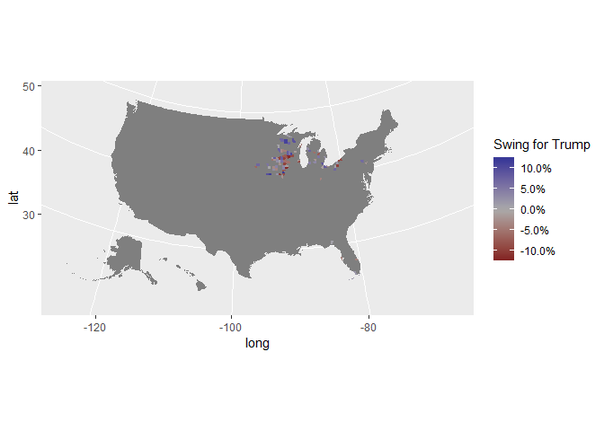<!-- -->

## Florida

``` r
county_2012 %>% filter(state_name == 'Florida') %>%
  ggplot(aes(long, lat, group = group, fill = trump_gain)) +
  geom_polygon(color = "#ffffff") +
  scale_fill_gradient2(labels = scales::percent,
                       low = muted('blue'),  mid = '#888888', na.value = 'gray80',
                       high = muted('red'), midpoint = 0,
                       guide = guide_colorbar(title.position = "top")) +
  coord_map(projection = "albers", lat0 = 39, lat1 = 45) +
  labs(fill = "Swing for Trump")
```

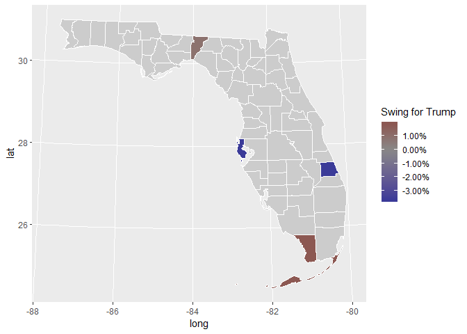<!-- -->

``` r
fl_2012 <- (data_2012 %>% filter(state == 'Florida'))
kable(fl_2012[order(-fl_2012$trump_gain),c('county','trump_gain')])
```

<table>

<thead>

<tr>

<th style="text-align:left;">

</th>

<th style="text-align:left;">

county

</th>

<th style="text-align:right;">

trump\_gain

</th>

</tr>

</thead>

<tbody>

<tr>

<td style="text-align:left;">

2

</td>

<td style="text-align:left;">

Monroe

</td>

<td style="text-align:right;">

0.0188428

</td>

</tr>

<tr>

<td style="text-align:left;">

1

</td>

<td style="text-align:left;">

Jefferson

</td>

<td style="text-align:right;">

0.0088105

</td>

</tr>

<tr>

<td style="text-align:left;">

4

</td>

<td style="text-align:left;">

St. Lucie

</td>

<td style="text-align:right;">

\-0.0363577

</td>

</tr>

<tr>

<td style="text-align:left;">

3

</td>

<td style="text-align:left;">

Pinellas

</td>

<td style="text-align:right;">

\-0.0366181

</td>

</tr>

</tbody>

</table>

## Iowa

``` r
county_2012 %>% filter(state_name == 'Iowa') %>%
  ggplot(aes(long, lat, group = group, fill = trump_gain)) +
  geom_polygon(color = "#ffffff") +
  scale_fill_gradient2(labels = scales::percent,
                       low = muted('blue'),  mid = '#888888', na.value = 'gray80',
                       high = muted('red'), midpoint = 0,
                       guide = guide_colorbar(title.position = "top")) +
  coord_map(projection = "albers", lat0 = 39, lat1 = 45) +
  labs(fill = "Swing for Trump")
```

<!-- -->

``` r
ia_2012 <- (data_2012 %>% filter(state == 'Iowa'))
kable(ia_2012[order(-ia_2012$trump_gain),c('county','trump_gain')])
```

<table>

<thead>

<tr>

<th style="text-align:left;">

</th>

<th style="text-align:left;">

county

</th>

<th style="text-align:right;">

trump\_gain

</th>

</tr>

</thead>

<tbody>

<tr>

<td style="text-align:left;">

21

</td>

<td style="text-align:left;">

Louisa

</td>

<td style="text-align:right;">

0.1192607

</td>

</tr>

<tr>

<td style="text-align:left;">

8

</td>

<td style="text-align:left;">

Clarke

</td>

<td style="text-align:right;">

0.1149845

</td>

</tr>

<tr>

<td style="text-align:left;">

27

</td>

<td style="text-align:left;">

Union

</td>

<td style="text-align:right;">

0.0935963

</td>

</tr>

<tr>

<td style="text-align:left;">

23

</td>

<td style="text-align:left;">

Mitchell

</td>

<td style="text-align:right;">

0.0820841

</td>

</tr>

<tr>

<td style="text-align:left;">

1

</td>

<td style="text-align:left;">

Allamakee

</td>

<td style="text-align:right;">

0.0788150

</td>

</tr>

<tr>

<td style="text-align:left;">

31

</td>

<td style="text-align:left;">

Woodbury

</td>

<td style="text-align:right;">

0.0702114

</td>

</tr>

<tr>

<td style="text-align:left;">

9

</td>

<td style="text-align:left;">

Clayton

</td>

<td style="text-align:right;">

0.0564940

</td>

</tr>

<tr>

<td style="text-align:left;">

29

</td>

<td style="text-align:left;">

Webster

</td>

<td style="text-align:right;">

0.0555609

</td>

</tr>

<tr>

<td style="text-align:left;">

5

</td>

<td style="text-align:left;">

Cedar

</td>

<td style="text-align:right;">

0.0396867

</td>

</tr>

<tr>

<td style="text-align:left;">

26

</td>

<td style="text-align:left;">

Tama

</td>

<td style="text-align:right;">

0.0392055

</td>

</tr>

<tr>

<td style="text-align:left;">

19

</td>

<td style="text-align:left;">

Jones

</td>

<td style="text-align:right;">

0.0348722

</td>

</tr>

<tr>

<td style="text-align:left;">

7

</td>

<td style="text-align:left;">

Chickasaw

</td>

<td style="text-align:right;">

0.0333889

</td>

</tr>

<tr>

<td style="text-align:left;">

17

</td>

<td style="text-align:left;">

Jasper

</td>

<td style="text-align:right;">

0.0292010

</td>

</tr>

<tr>

<td style="text-align:left;">

28

</td>

<td style="text-align:left;">

Wapello

</td>

<td style="text-align:right;">

0.0259513

</td>

</tr>

<tr>

<td style="text-align:left;">

3

</td>

<td style="text-align:left;">

Bremer

</td>

<td style="text-align:right;">

0.0256836

</td>

</tr>

<tr>

<td style="text-align:left;">

32

</td>

<td style="text-align:left;">

Worth

</td>

<td style="text-align:right;">

0.0129484

</td>

</tr>

<tr>

<td style="text-align:left;">

13

</td>

<td style="text-align:left;">

Fayette

</td>

<td style="text-align:right;">

0.0104469

</td>

</tr>

<tr>

<td style="text-align:left;">

2

</td>

<td style="text-align:left;">

Boone

</td>

<td style="text-align:right;">

0.0050890

</td>

</tr>

<tr>

<td style="text-align:left;">

16

</td>

<td style="text-align:left;">

Jackson

</td>

<td style="text-align:right;">

\-0.0118544

</td>

</tr>

<tr>

<td style="text-align:left;">

20

</td>

<td style="text-align:left;">

Lee

</td>

<td style="text-align:right;">

\-0.0215049

</td>

</tr>

<tr>

<td style="text-align:left;">

15

</td>

<td style="text-align:left;">

Howard

</td>

<td style="text-align:right;">

\-0.0231963

</td>

</tr>

<tr>

<td style="text-align:left;">

4

</td>

<td style="text-align:left;">

Buchanan

</td>

<td style="text-align:right;">

\-0.0236260

</td>

</tr>

<tr>

<td style="text-align:left;">

14

</td>

<td style="text-align:left;">

Floyd

</td>

<td style="text-align:right;">

\-0.0239878

</td>

</tr>

<tr>

<td style="text-align:left;">

22

</td>

<td style="text-align:left;">

Marshall

</td>

<td style="text-align:right;">

\-0.0293535

</td>

</tr>

<tr>

<td style="text-align:left;">

25

</td>

<td style="text-align:left;">

Poweshiek

</td>

<td style="text-align:right;">

\-0.0340425

</td>

</tr>

<tr>

<td style="text-align:left;">

6

</td>

<td style="text-align:left;">

Cerro Gordo

</td>

<td style="text-align:right;">

\-0.0529013

</td>

</tr>

<tr>

<td style="text-align:left;">

24

</td>

<td style="text-align:left;">

Muscatine

</td>

<td style="text-align:right;">

\-0.0768412

</td>

</tr>

<tr>

<td style="text-align:left;">

11

</td>

<td style="text-align:left;">

Des Moines

</td>

<td style="text-align:right;">

\-0.0843517

</td>

</tr>

<tr>

<td style="text-align:left;">

12

</td>

<td style="text-align:left;">

Dubuque

</td>

<td style="text-align:right;">

\-0.0934204

</td>

</tr>

<tr>

<td style="text-align:left;">

30

</td>

<td style="text-align:left;">

Winneshiek

</td>

<td style="text-align:right;">

\-0.0940774

</td>

</tr>

<tr>

<td style="text-align:left;">

18

</td>

<td style="text-align:left;">

Jefferson

</td>

<td style="text-align:right;">

\-0.1029464

</td>

</tr>

<tr>

<td style="text-align:left;">

10

</td>

<td style="text-align:left;">

Clinton

</td>

<td style="text-align:right;">

\-0.1168031

</td>

</tr>

</tbody>

</table>

## Michigan

``` r
county_2012 %>% filter(state_name == 'Michigan') %>%
  ggplot(aes(long, lat, group = group, fill = trump_gain)) +
  geom_polygon(color = "#ffffff") +
  scale_fill_gradient2(labels = scales::percent,
                       low = muted('blue'),  mid = '#888888', na.value = 'gray80',
                       high = muted('red'), midpoint = 0,
                       guide = guide_colorbar(title.position = "top")) +
  coord_map(projection = "albers", lat0 = 39, lat1 = 45) +
  labs(fill = "Swing for Trump")
```

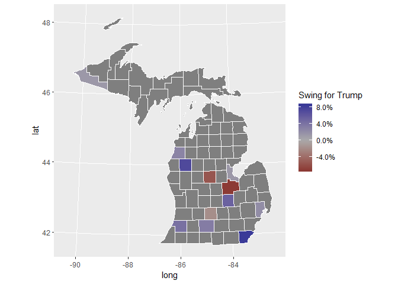<!-- -->

``` r
mi_2012 <- (data_2012 %>% filter(state == 'Michigan'))
kable(mi_2012[order(-mi_2012$trump_gain),c('county','trump_gain')])
```

<table>

<thead>

<tr>

<th style="text-align:left;">

</th>

<th style="text-align:left;">

county

</th>

<th style="text-align:right;">

trump\_gain

</th>

</tr>

</thead>

<tbody>

<tr>

<td style="text-align:left;">

9

</td>

<td style="text-align:left;">

Monroe

</td>

<td style="text-align:right;">

0.0844901

</td>

</tr>

<tr>

<td style="text-align:left;">

6

</td>

<td style="text-align:left;">

Lake

</td>

<td style="text-align:right;">

0.0723834

</td>

</tr>

<tr>

<td style="text-align:left;">

11

</td>

<td style="text-align:left;">

Shiawassee

</td>

<td style="text-align:right;">

0.0531328

</td>

</tr>

<tr>

<td style="text-align:left;">

12

</td>

<td style="text-align:left;">

Van Buren

</td>

<td style="text-align:right;">

0.0415703

</td>

</tr>

<tr>

<td style="text-align:left;">

2

</td>

<td style="text-align:left;">

Calhoun

</td>

<td style="text-align:right;">

0.0329103

</td>

</tr>

<tr>

<td style="text-align:left;">

8

</td>

<td style="text-align:left;">

Manistee

</td>

<td style="text-align:right;">

0.0269211

</td>

</tr>

<tr>

<td style="text-align:left;">

7

</td>

<td style="text-align:left;">

Macomb

</td>

<td style="text-align:right;">

0.0210128

</td>

</tr>

<tr>

<td style="text-align:left;">

4

</td>

<td style="text-align:left;">

Gogebic

</td>

<td style="text-align:right;">

0.0125942

</td>

</tr>

<tr>

<td style="text-align:left;">

1

</td>

<td style="text-align:left;">

Bay

</td>

<td style="text-align:right;">

0.0124956

</td>

</tr>

<tr>

<td style="text-align:left;">

3

</td>

<td style="text-align:left;">

Eaton

</td>

<td style="text-align:right;">

\-0.0183930

</td>

</tr>

<tr>

<td style="text-align:left;">

5

</td>

<td style="text-align:left;">

Isabella

</td>

<td style="text-align:right;">

\-0.0546686

</td>

</tr>

<tr>

<td style="text-align:left;">

10

</td>

<td style="text-align:left;">

Saginaw

</td>

<td style="text-align:right;">

\-0.0724856

</td>

</tr>

</tbody>

</table>

## Ohio

``` r
county_2012 %>% filter(state_name == 'Ohio') %>%
  ggplot(aes(long, lat, group = group, fill = trump_gain)) +
  geom_polygon(color = "#ffffff") +
  scale_fill_gradient2(labels = scales::percent,
                       low = muted('blue'),  mid = '#888888', na.value = 'gray80',
                       high = muted('red'), midpoint = 0,
                       guide = guide_colorbar(title.position = "top")) +
  coord_map(projection = "albers", lat0 = 39, lat1 = 45) +
  labs(fill = "Swing for Trump")
```

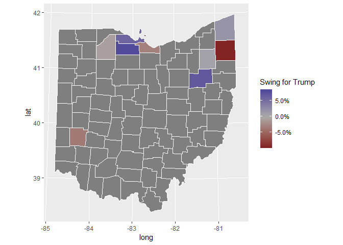<!-- -->

``` r
oh_2012 <- (data_2012 %>% filter(state == 'Ohio'))
kable(oh_2012[order(-oh_2012$trump_gain),c('county','trump_gain')])
```

<table>

<thead>

<tr>

<th style="text-align:left;">

</th>

<th style="text-align:left;">

county

</th>

<th style="text-align:right;">

trump\_gain

</th>

</tr>

</thead>

<tbody>

<tr>

<td style="text-align:left;">

6

</td>

<td style="text-align:left;">

Sandusky

</td>

<td style="text-align:right;">

0.0802825

</td>

</tr>

<tr>

<td style="text-align:left;">

7

</td>

<td style="text-align:left;">

Stark

</td>

<td style="text-align:right;">

0.0686496

</td>

</tr>

<tr>

<td style="text-align:left;">

4

</td>

<td style="text-align:left;">

Ottawa

</td>

<td style="text-align:right;">

0.0572470

</td>

</tr>

<tr>

<td style="text-align:left;">

1

</td>

<td style="text-align:left;">

Ashtabula

</td>

<td style="text-align:right;">

0.0178472

</td>

</tr>

<tr>

<td style="text-align:left;">

5

</td>

<td style="text-align:left;">

Portage

</td>

<td style="text-align:right;">

0.0074830

</td>

</tr>

<tr>

<td style="text-align:left;">

9

</td>

<td style="text-align:left;">

Wood

</td>

<td style="text-align:right;">

\-0.0078580

</td>

</tr>

<tr>

<td style="text-align:left;">

2

</td>

<td style="text-align:left;">

Erie

</td>

<td style="text-align:right;">

\-0.0301925

</td>

</tr>

<tr>

<td style="text-align:left;">

3

</td>

<td style="text-align:left;">

Montgomery

</td>

<td style="text-align:right;">

\-0.0353141

</td>

</tr>

<tr>

<td style="text-align:left;">

8

</td>

<td style="text-align:left;">

Trumbull

</td>

<td style="text-align:right;">

\-0.0957853

</td>

</tr>

</tbody>

</table>

## Pennsylvania

``` r
county_2012 %>% filter(state_name == 'Pennsylvania') %>%
  ggplot(aes(long, lat, group = group, fill = trump_gain)) +
  geom_polygon(color = "#ffffff") +
  scale_fill_gradient2(labels = scales::percent,
                       low = muted('blue'),  mid = '#888888', na.value = 'gray80',
                       high = muted('red'), midpoint = 0,
                       guide = guide_colorbar(title.position = "top")) +
  coord_map(projection = "albers", lat0 = 39, lat1 = 45) +
  labs(fill = "Swing for Trump")
```

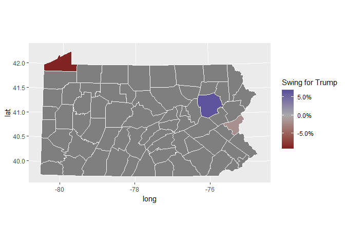<!-- -->

``` r
pa_2012 <- (data_2012 %>% filter(state == 'Pennsylvania'))
kable(pa_2012[order(-pa_2012$trump_gain),c('county','trump_gain')])
```

<table>

<thead>

<tr>

<th style="text-align:left;">

</th>

<th style="text-align:left;">

county

</th>

<th style="text-align:right;">

trump\_gain

</th>

</tr>

</thead>

<tbody>

<tr>

<td style="text-align:left;">

2

</td>

<td style="text-align:left;">

Luzerne

</td>

<td style="text-align:right;">

0.0661722

</td>

</tr>

<tr>

<td style="text-align:left;">

3

</td>

<td style="text-align:left;">

Northampton

</td>

<td style="text-align:right;">

\-0.0172862

</td>

</tr>

<tr>

<td style="text-align:left;">

1

</td>

<td style="text-align:left;">

Erie

</td>

<td style="text-align:right;">

\-0.0878828

</td>

</tr>

</tbody>

</table>

## Wisconsin

``` r
county_2012 %>% filter(state_name == 'Wisconsin') %>%
  ggplot(aes(long, lat, group = group, fill = trump_gain)) +
  geom_polygon(color = "#ffffff") +
  scale_fill_gradient2(labels = scales::percent,
                       low = muted('blue'),  mid = '#888888', na.value = 'gray80',
                       high = muted('red'), midpoint = 0,
                       guide = guide_colorbar(title.position = "top")) +
  coord_map(projection = "albers", lat0 = 39, lat1 = 45) +
  labs(fill = "Swing for Trump")
```

<!-- -->

``` r
wi_2012 <- (data_2012 %>% filter(state == 'Wisconsin'))
kable(wi_2012[order(-wi_2012$trump_gain),c('county','trump_gain')])
```

<table>

<thead>

<tr>

<th style="text-align:left;">

</th>

<th style="text-align:left;">

county

</th>

<th style="text-align:right;">

trump\_gain

</th>

</tr>

</thead>

<tbody>

<tr>

<td style="text-align:left;">

16

</td>

<td style="text-align:left;">

Price

</td>

<td style="text-align:right;">

0.1101222

</td>

</tr>

<tr>

<td style="text-align:left;">

14

</td>

<td style="text-align:left;">

Marquette

</td>

<td style="text-align:right;">

0.1019882

</td>

</tr>

<tr>

<td style="text-align:left;">

7

</td>

<td style="text-align:left;">

Forest

</td>

<td style="text-align:right;">

0.0923671

</td>

</tr>

<tr>

<td style="text-align:left;">

15

</td>

<td style="text-align:left;">

Pepin

</td>

<td style="text-align:right;">

0.0828332

</td>

</tr>

<tr>

<td style="text-align:left;">

10

</td>

<td style="text-align:left;">

Juneau

</td>

<td style="text-align:right;">

0.0793674

</td>

</tr>

<tr>

<td style="text-align:left;">

13

</td>

<td style="text-align:left;">

Lincoln

</td>

<td style="text-align:right;">

0.0741528

</td>

</tr>

<tr>

<td style="text-align:left;">

2

</td>

<td style="text-align:left;">

Buffalo

</td>

<td style="text-align:right;">

0.0722476

</td>

</tr>

<tr>

<td style="text-align:left;">

20

</td>

<td style="text-align:left;">

Sawyer

</td>

<td style="text-align:right;">

0.0714047

</td>

</tr>

<tr>

<td style="text-align:left;">

1

</td>

<td style="text-align:left;">

Adams

</td>

<td style="text-align:right;">

0.0499080

</td>

</tr>

<tr>

<td style="text-align:left;">

6

</td>

<td style="text-align:left;">

Dunn

</td>

<td style="text-align:right;">

0.0054800

</td>

</tr>

<tr>

<td style="text-align:left;">

23

</td>

<td style="text-align:left;">

Winnebago

</td>

<td style="text-align:right;">

\-0.0110951

</td>

</tr>

<tr>

<td style="text-align:left;">

17

</td>

<td style="text-align:left;">

Racine

</td>

<td style="text-align:right;">

\-0.0176673

</td>

</tr>

<tr>

<td style="text-align:left;">

21

</td>

<td style="text-align:left;">

Trempealeau

</td>

<td style="text-align:right;">

\-0.0256264

</td>

</tr>

<tr>

<td style="text-align:left;">

9

</td>

<td style="text-align:left;">

Jackson

</td>

<td style="text-align:right;">

\-0.0396544

</td>

</tr>

<tr>

<td style="text-align:left;">

5

</td>

<td style="text-align:left;">

Door

</td>

<td style="text-align:right;">

\-0.0420059

</td>

</tr>

<tr>

<td style="text-align:left;">

12

</td>

<td style="text-align:left;">

Lafayette

</td>

<td style="text-align:right;">

\-0.0513675

</td>

</tr>

<tr>

<td style="text-align:left;">

8

</td>

<td style="text-align:left;">

Grant

</td>

<td style="text-align:right;">

\-0.0528731

</td>

</tr>

<tr>

<td style="text-align:left;">

22

</td>

<td style="text-align:left;">

Vernon

</td>

<td style="text-align:right;">

\-0.0715141

</td>

</tr>

<tr>

<td style="text-align:left;">

18

</td>

<td style="text-align:left;">

Richland

</td>

<td style="text-align:right;">

\-0.0746777

</td>

</tr>

<tr>

<td style="text-align:left;">

3

</td>

<td style="text-align:left;">

Columbia

</td>

<td style="text-align:right;">

\-0.0866361

</td>

</tr>

<tr>

<td style="text-align:left;">

11

</td>

<td style="text-align:left;">

Kenosha

</td>

<td style="text-align:right;">

\-0.0872230

</td>

</tr>

<tr>

<td style="text-align:left;">

4

</td>

<td style="text-align:left;">

Crawford

</td>

<td style="text-align:right;">

\-0.0957866

</td>

</tr>

<tr>

<td style="text-align:left;">

19

</td>

<td style="text-align:left;">

Sauk

</td>

<td style="text-align:right;">

\-0.1145544

</td>

</tr>

</tbody>

</table>

# Critical Result: Do these 2012 Obama-Trump counties matter? (Yes, they swung the election)

Do these counties really matter? If they did, they “swung” the election
for Trump. Contrast this with a “surge” of voters in safe counties. Lets
see if there are sufficient votes from these Obama-Trump counties to
swing the election. First we need to get Clinton’s results for the
Obama-Trump
counties:

``` r
clinton_2016 <- relevant_data[relevant_data$state %in% counties_trump_won$state & relevant_data$county %in% counties_trump_won$county & relevant_data$party == 'democrat' & relevant_data$year == 2016,]
```

Now we merge the two datasets together to compute the margins in the
Obama-Trump
counties.

``` r
merged_2016 <- merge(trump_intersect_2012, clinton_2016, by=c('state','county','FIPS'));
merged_2016$margin <- merged_2016$candidatevotes.x - merged_2016$candidatevotes.y

margin_by_counties_2016 <- merged_2016 %>% group_by(state) %>% summarize(margin = sum(margin))

margin_by_counties_2016$pivot <- 1 + (margin_by_counties_2016$margin %/% 2)

kable(margin_by_counties_2016)
```

<table>

<thead>

<tr>

<th style="text-align:left;">

state

</th>

<th style="text-align:right;">

margin

</th>

<th style="text-align:right;">

pivot

</th>

</tr>

</thead>

<tbody>

<tr>

<td style="text-align:left;">

Florida

</td>

<td style="text-align:right;">

232423

</td>

<td style="text-align:right;">

116212

</td>

</tr>

<tr>

<td style="text-align:left;">

Iowa

</td>

<td style="text-align:right;">

83947

</td>

<td style="text-align:right;">

41974

</td>

</tr>

<tr>

<td style="text-align:left;">

Michigan

</td>

<td style="text-align:right;">

171686

</td>

<td style="text-align:right;">

85844

</td>

</tr>

<tr>

<td style="text-align:left;">

Nebraska

</td>

<td style="text-align:right;">

43569

</td>

<td style="text-align:right;">

21785

</td>

</tr>

<tr>

<td style="text-align:left;">

Ohio

</td>

<td style="text-align:right;">

219133

</td>

<td style="text-align:right;">

109567

</td>

</tr>

<tr>

<td style="text-align:left;">

Pennsylvania

</td>

<td style="text-align:right;">

154450

</td>

<td style="text-align:right;">

77226

</td>

</tr>

<tr>

<td style="text-align:left;">

Wisconsin

</td>

<td style="text-align:right;">

63839

</td>

<td style="text-align:right;">

31920

</td>

</tr>

</tbody>

</table>

We need to compare the results for the 7
states.

``` r
state_2016 <- state_results[which(state_results$year == 2016 & state_results$state %in% merged_2016$state & (state_results$party == 'democrat' | state_results$party == 'republican')),]
```

We should also track the third party votes, since presumably they also
acted as a
[spoiler](https://en.wikipedia.org/wiki/Spoiler_effect).

``` r
margin_2016_by_state <- state_2016 %>% group_by(state) %>% summarize(margin = max(candidatevotes) - min(candidatevotes), third_party_votes = max(totalvotes) - sum(candidatevotes))
kable(margin_2016_by_state)
```

<table>

<thead>

<tr>

<th style="text-align:left;">

state

</th>

<th style="text-align:right;">

margin

</th>

<th style="text-align:right;">

third\_party\_votes

</th>

</tr>

</thead>

<tbody>

<tr>

<td style="text-align:left;">

Florida

</td>

<td style="text-align:right;">

112911

</td>

<td style="text-align:right;">

297178

</td>

</tr>

<tr>

<td style="text-align:left;">

Iowa

</td>

<td style="text-align:right;">

147314

</td>

<td style="text-align:right;">

110928

</td>

</tr>

<tr>

<td style="text-align:left;">

Michigan

</td>

<td style="text-align:right;">

10704

</td>

<td style="text-align:right;">

250902

</td>

</tr>

<tr>

<td style="text-align:left;">

Nebraska

</td>

<td style="text-align:right;">

211467

</td>

<td style="text-align:right;">

63772

</td>

</tr>

<tr>

<td style="text-align:left;">

Ohio

</td>

<td style="text-align:right;">

446841

</td>

<td style="text-align:right;">

261318

</td>

</tr>

<tr>

<td style="text-align:left;">

Pennsylvania

</td>

<td style="text-align:right;">

44292

</td>

<td style="text-align:right;">

218228

</td>

</tr>

<tr>

<td style="text-align:left;">

Wisconsin

</td>

<td style="text-align:right;">

22748

</td>

<td style="text-align:right;">

188330

</td>

</tr>

</tbody>

</table>

Now we can answer the question,
finally\!

``` r
pivots_by_state <- merge(margin_2016_by_state,margin_by_counties_2016,c('state'))
pivots_by_state$swingable <- pivots_by_state$margin.x < pivots_by_state$pivot
colnames(pivots_by_state)[colnames(pivots_by_state)=="margin.x"] <- "state_margin"
colnames(pivots_by_state)[colnames(pivots_by_state)=="margin.y"] <- "swing_counties_margin"
colnames(pivots_by_state)[colnames(pivots_by_state)=="third_party_votes.x"] <- "state_third_party_votes"
colnames(pivots_by_state)[colnames(pivots_by_state)=="third_party_votes.y"] <- "swing_counties_third_party_votes"
kable(pivots_by_state)
```

<table>

<thead>

<tr>

<th style="text-align:left;">

state

</th>

<th style="text-align:right;">

state\_margin

</th>

<th style="text-align:right;">

third\_party\_votes

</th>

<th style="text-align:right;">

swing\_counties\_margin

</th>

<th style="text-align:right;">

pivot

</th>

<th style="text-align:left;">

swingable

</th>

</tr>

</thead>

<tbody>

<tr>

<td style="text-align:left;">

Florida

</td>

<td style="text-align:right;">

112911

</td>

<td style="text-align:right;">

297178

</td>

<td style="text-align:right;">

232423

</td>

<td style="text-align:right;">

116212

</td>

<td style="text-align:left;">

TRUE

</td>

</tr>

<tr>

<td style="text-align:left;">

Iowa

</td>

<td style="text-align:right;">

147314

</td>

<td style="text-align:right;">

110928

</td>

<td style="text-align:right;">

83947

</td>

<td style="text-align:right;">

41974

</td>

<td style="text-align:left;">

FALSE

</td>

</tr>

<tr>

<td style="text-align:left;">

Michigan

</td>

<td style="text-align:right;">

10704

</td>

<td style="text-align:right;">

250902

</td>

<td style="text-align:right;">

171686

</td>

<td style="text-align:right;">

85844

</td>

<td style="text-align:left;">

TRUE

</td>

</tr>

<tr>

<td style="text-align:left;">

Nebraska

</td>

<td style="text-align:right;">

211467

</td>

<td style="text-align:right;">

63772

</td>

<td style="text-align:right;">

43569

</td>

<td style="text-align:right;">

21785

</td>

<td style="text-align:left;">

FALSE

</td>

</tr>

<tr>

<td style="text-align:left;">

Ohio

</td>

<td style="text-align:right;">

446841

</td>

<td style="text-align:right;">

261318

</td>

<td style="text-align:right;">

219133

</td>

<td style="text-align:right;">

109567

</td>

<td style="text-align:left;">

FALSE

</td>

</tr>

<tr>

<td style="text-align:left;">

Pennsylvania

</td>

<td style="text-align:right;">

44292

</td>

<td style="text-align:right;">

218228

</td>

<td style="text-align:right;">

154450

</td>

<td style="text-align:right;">

77226

</td>

<td style="text-align:left;">

TRUE

</td>

</tr>

<tr>

<td style="text-align:left;">

Wisconsin

</td>

<td style="text-align:right;">

22748

</td>

<td style="text-align:right;">

188330

</td>

<td style="text-align:right;">

63839

</td>

<td style="text-align:right;">

31920

</td>

<td style="text-align:left;">

TRUE

</td>

</tr>

</tbody>

</table>

So, Iowa, Nebraska, and Ohio were not swingable. But if Florida,
Michigan, Pennsylvania, and Wisconsin had swung for Clinton, that is a
difference of 29, 16, 20, and 10 electoral votes for a sum of 75
electoral votes. Had this happen, Trump would have received 229
electoral votes to Clinton’s 302.

On the other hand, the third party votes
